# Phát hiện Vật thể Bỏ quên Thời gian thực trên CPU bằng Nền-kép Cố định kết hợp Cổng Ngữ nghĩa

**Báo cáo kỹ thuật — Realtime Abandoned-Object Detection (demov2)**

> Tài liệu liên quan: [`README.md`](README.md) (hướng dẫn chạy), [`solution_analysis.md`](solution_analysis.md) (hồ sơ phát triển chi tiết). Mã nguồn: `run_rtsbs_aod.py` (orchestrator) + `core/` (7 module) + `app.py` (GUI).

---

## Tóm tắt (Abstract)

Dự án là một hệ thống **phát hiện vật thể bỏ quên** (abandoned-object detection, AOD) chạy **thời-gian-thực trên CPU**, không cần GPU. Hệ thống kết hợp ba thành phần: (i) một **mô hình nền-kép** gồm nền-ngắn-hạn thích nghi (ViBe [1]) và **nền-sạch dài-hạn cố định** (frozen median) để một vật mới đặt vào không bao giờ bị "nuốt" như nền thích nghi thông thường; (ii) một **máy trạng thái hữu hạn theo từng điểm ảnh** (Static Foreground FSM) tích lũy *tuổi-tĩnh*; và (iii) một **cổng ngữ nghĩa** dùng phân đoạn thực thể YOLO-seg [6,7] để loại **mọi đối-tượng-chuyển-động** (người, xe, động vật) và giữ lại lớp *vật* (balo, vali, túi…). Kế thừa khung *Semantic Background Subtraction* (RT-SBS) [3,4], hệ thống bổ sung bốn lớp xử lý nền/ánh sáng và bốn cổng cảnh-báo được thiết kế để **thiên về recall** (an ninh: bỏ-sót-vật tệ hơn báo-nhầm). Trên bộ chuẩn công khai **ABODA** [12] (13 video, gồm 2 video camera thực độ-phân-giải-cao), hệ thống đạt **Recall 12/12** (bắt được mọi vật mục tiêu) với **18 báo-nhầm (FP)**, chạy **~5–9 khung hình/giây** trên CPU laptop nhờ tăng tốc OpenVINO [13]. Báo cáo trình bày kiến trúc, sơ đồ luồng, tham số điều chỉnh trade-off recall–precision, kết quả thực nghiệm và phân tích ablation cho từng cơ chế.

**Từ khóa:** abandoned object detection, background subtraction, semantic segmentation, dual background, real-time, ViBe, RT-SBS, YOLO.

---

## 1. Giới thiệu (Introduction)

### 1.1. Bài toán

Phát hiện vật thể bỏ quên là bài toán giám sát: cho một camera **cố định**, phát hiện một vật **được mang vào cảnh rồi để lại** (balo, vali, túi, thùng…) và phát cảnh báo sau khi nó **đứng yên đủ lâu** mà **chủ đã rời đi**. Đây là bài toán quan trọng cho an ninh nơi công cộng (sân bay, nhà ga) và phát hiện đổ rác trái phép.

Định nghĩa vận hành mà hệ thống sử dụng:

> **Vật bỏ quên = (khác nền sạch) ∧ (đứng yên ≥ T giây) ∧ (không phải đối-tượng-chuyển-động: người/xe/động vật).**

### 1.2. Thách thức

1. **Nền thích nghi nuốt vật**: các thuật toán trừ-nền (BGS) cập-nhật-liên-tục (MOG [5], ViBe [1]) sẽ hấp thụ một vật đứng yên vào nền sau vài chục giây → vật biến mất khỏi tiền cảnh.
2. **Phân biệt vật vs người đứng yên**: một người đứng yên cũng "khác nền + tĩnh" → cần ngữ nghĩa để loại.
3. **Nhiễu ánh sáng**: đổi sáng ngày↔đêm, bật/tắt đèn cục bộ, bóng đổ → báo-nhầm.
4. **Ràng buộc tài nguyên**: chạy thời-gian-thực **trên CPU** (không GPU) cho triển khai biên rẻ.

### 1.3. Đóng góp

- Một **kiến trúc nền-kép cố định** (§4.1) giải quyết trực tiếp thách thức (1): nền-sạch là **median đóng băng** của giai đoạn khởi động, nên vật mới *luôn* khác nó.
- **Bốn lớp cập-nhật-nền/ánh-sáng** (§4.5) và **bốn cổng cảnh-báo** (§4.6) — mỗi cơ chế nhắm một nhóm báo-nhầm cụ thể, được *đo ablation* (§6.4).
- Một **cổng bằng-chứng (evidence-gate)** mới (§4.6) loại các *candidate "ma"* — vật đã bị một lớp cập-nhật-nền hấp thụ nhưng FSM còn giữ trễ.
- Một **audit mật độ cảnh** (§6.3) tách ba đại lượng dễ bị lẫn: số người ước lượng bằng mắt, số instance mà detector nhìn thấy, và diện-tích foreground thật theo nền sạch.
- Một **ứng dụng GUI** (§4.7) cho triển khai thực: chọn video/camera, vẽ hộp cảnh báo trực tiếp, danh sách vật-bỏ-quên tự cập nhật khi vật được lấy đi, lưu JSON từng vật.

---

## 2. Công trình liên quan (Related Work)

**Trừ nền (Background Subtraction).** MOG [5] mô hình mỗi điểm ảnh bằng hỗn hợp Gauss; ViBe [1,2] là mô hình phi-tham-số dựa trên mẫu, nhanh và bền với nhiễu, được dùng làm *cổng-chuyển-động ngắn hạn* của chúng tôi. Tổng quan các hướng BGS xem [11]. Hạn chế chung: nền cập-nhật-liên-tục **hấp thụ vật tĩnh** — chính là lý do AOD cần nền-kép.

**Trừ nền ngữ nghĩa (Semantic BGS / RT-SBS).** Braham et al. [4] đề xuất dùng phân đoạn ngữ nghĩa để sửa quyết định BGS; Cioppa et al. [3] đưa ra phiên bản *thời-gian-thực* (RT-SBS) với bảng quyết định τ_BG/τ_FG và tái-sử-dụng màu liên-khung. Hệ thống của chúng tôi **kế thừa khung RT-SBS** và gắn thêm một nhánh AOD độc lập dùng nền-sạch cố định.

**Phát hiện vật bỏ quên (AOD).** Porikli et al. [9] dùng **nền-kép** (foreground ngắn & dài hạn) để tách vật tĩnh — ý tưởng nền-tảng mà chúng tôi hiện thực bằng median-đóng-băng. Tian et al. [10] xử lý vật bỏ-lại *và* bị-lấy-đi trong cảnh phức tạp. Bộ dữ liệu chuẩn **ABODA** [12] (Lin et al.) được dùng để đánh giá.

**Phát hiện & phân đoạn đối tượng.** YOLO [6] và họ Ultralytics YOLO [7] cung cấp phân-đoạn-thực-thể thời-gian-thực; chúng tôi dùng `yolo26s-seg` làm nguồn ngữ nghĩa mặc định. SegFormer [8] là tùy chọn phân-đoạn-dày (dense) cắm-thay-được cho chế độ feedback hai chiều.

**Tăng tốc CPU.** Bộ công cụ OpenVINO [13] của Intel cho phép chạy YOLO-seg trên CPU nhanh ~1.5× so với PyTorch (§6.5). Khử-artifact-sáng dùng tương-quan-chéo-chuẩn-hóa (NCC) [14].

---

## 3. Tổng quan hệ thống (System Overview)

Hệ thống xử lý **tuần tự từng khung hình**. Hình 1 mô tả kiến trúc tổng quan.

**Hình 1 — Kiến trúc tổng quan.**
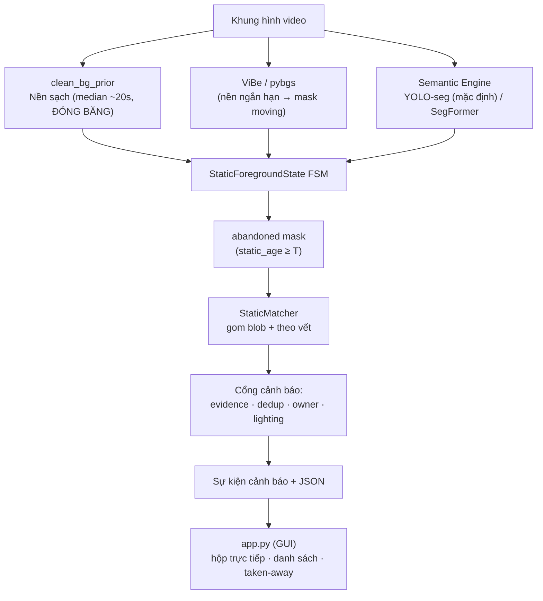

Năm khối: (1) **dựng nền-sạch** khởi động; (2) **mask chuyển động** (ViBe); (3) **nguồn ngữ nghĩa** (YOLO-seg); (4) **FSM tĩnh** sinh `abandoned`; (5) **matcher + cổng cảnh báo** sinh sự kiện. Nguồn ngữ nghĩa **cắm-thay-được**: bất kỳ model nào xuất ba bản-đồ-điểm `animate/object/stuff` đều dùng được mà không phải sửa FSM.

---

## 4. Phương pháp (Method)

### 4.1. Mô hình nền-kép (Dual Background)

Khác với BGS đơn (nuốt vật tĩnh), chúng tôi giữ **hai** nền:

- **Nền ngắn hạn thích nghi** `ViBe` [1]: mỗi điểm ảnh giữ một tập mẫu lịch sử; pixel khác xa tập mẫu → *moving*. Cập-nhật-liên-tục → bám nhiễu/chuyển động nhanh. Vai trò: **cổng-chuyển-động**.
- **Nền-sạch dài hạn** `clean_bg`: **median theo từng điểm ảnh** của `--bg-learn-seconds` (mặc định 20s) đầu video, sau đó **đóng băng** (chỉ cập-nhật rất chậm/có-kiểm-soát, §4.5). Vì đóng băng nên **một vật đặt vào sau giai đoạn học sẽ LUÔN khác `clean_bg`** ⇒ không bị hấp thụ.

Đây là hiện thực của ý tưởng nền-kép Porikli [9] bằng median-đóng-băng — đơn giản, không tham số học, bền.

### 4.2. Luồng xử lý từng khung hình (Per-frame Pipeline)

Hình 2 mô tả luồng dữ liệu trong một khung hình.

**Hình 2 — Luồng xử lý một khung hình.**
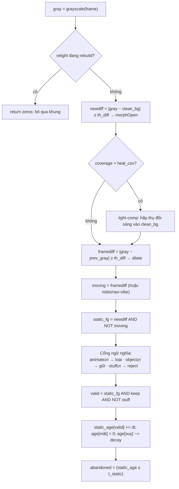

Hai mask phụ trợ: `tight = newdiff AND NOT framediff` (giữ **toàn-hình-vật** để tinh-chỉnh hộp), và `clean_bg slow-update` ở các pixel **không-static** (hấp thụ trôi-nền chậm), có **persist-protect** chặn nuốt vật tĩnh.

### 4.3. Máy trạng thái tĩnh theo điểm ảnh (Static Foreground FSM)

Mỗi điểm ảnh chạy một FSM ngầm (Hình 3): tích `static_age` khi thỏa `valid`, reset khi mất tín hiệu, suy giảm có kiểm soát, và "chốt" thành `abandoned` khi đủ tuổi.

**Hình 3 — Trạng thái tuổi-tĩnh của một điểm ảnh.**
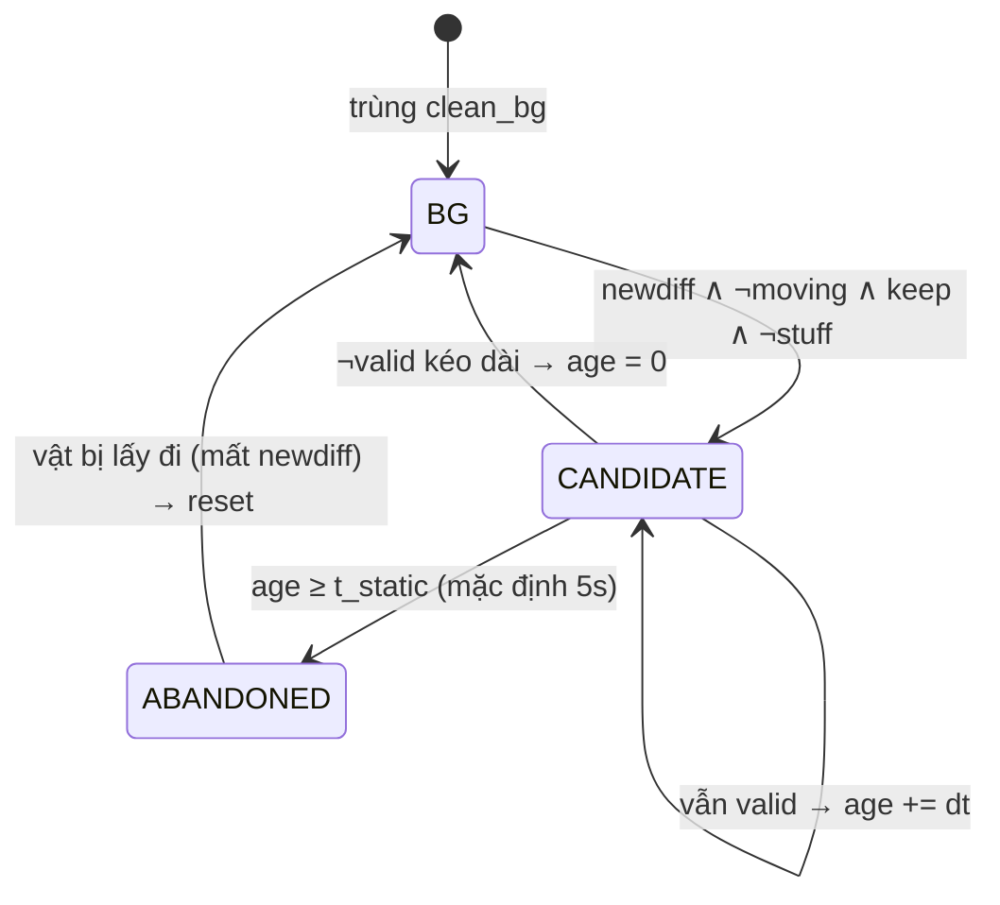

Sau FSM, `core/static_matching.py` (**StaticMatcher**) gom các blob `abandoned` thành **ứng viên** (candidate), theo-vết qua khung bằng IoU + khoảng cách, đếm số lần xuất hiện ổn định.

### 4.4. Cổng ngữ nghĩa: loại MỌI đối-tượng-chuyển-động

Điểm cốt lõi: hệ thống **không chỉ loại người** mà loại **toàn bộ lớp chuyển-động** qua **hai** cơ chế:

1. **Mask MOVING** (ViBe): loại mọi điểm ảnh *đang chuyển động* — bất kể lớp.
2. **Cổng animate** (YOLO-seg): loại các **lớp animate** (`person, bicycle, car, motorcycle, bus, truck, boat, airplane`, động vật) **kể cả khi đứng yên** — qua tập `MOVING_OBJECT_TERMS` trong `core/semantic_classes.py`.

Ba bản-đồ-điểm semantic (0..`SEMANTIC_MAX`):
- `animate_score` (người/xe/động vật) → **reject** (và bảo vệ FG nếu chạy feedback).
- `object_score` (balo/vali/túi/ô/chai) → **keep** (tăng tín hiệu giữ vật).
- `stuff_score` (sàn/tường/nước) → **reject** (chỉ bật khi model đủ tin).

Tính cắm-thay: `OnlineYoloSeg`/`OnlineSegFormer`/`OnlinePSPNet` chỉ cần hàm `infer()` trả bản-đồ-điểm.

### 4.5. Bốn lớp cập-nhật SÁNG & NỀN

Hình 4 nhóm bốn lớp đụng tới nền/ánh sáng; chi tiết và *cờ điều khiển* trong Bảng 1.

**Hình 4 — Các lớp cập-nhật nền/ánh-sáng.**
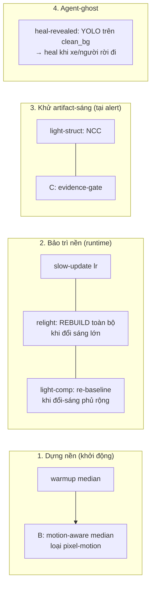

**Bảng 1 — Các cơ chế nền/ánh-sáng.**

| # | Cơ chế (cờ) | Kích hoạt khi | Hành vi | Báo-nhầm nhắm tới |
|---|---|---|---|---|
| 1a | warmup median (`--bg-learn-seconds`) | khởi động | `clean_bg` = median đóng băng | (nền tham chiếu) |
| 1b | **B** motion-mask (`--warmup-motion-mask` 1) | khởi động | median **loại pixel-motion** | warmup-ghost ĐỘNG (người/cửa đi qua) |
| 2a | slow-update (`--clean-update-lr`) | mỗi khung | EMA chậm ở pixel không-static (persist-protect chặn nuốt vật) | trôi-nền chậm |
| 2b | **relight** (`--relight-dv`,`-ds`,`-stable-dv`) | đổi sáng LỚN | **REBUILD** `clean_bg` ở plateau ổn định | đổi sáng ngày↔đêm / từ-từ |
| 2c | **light-comp** (`--heal-cov`,`--heal-alpha`) | diff phủ > 15% | re-baseline nền vùng đổi-sáng | đổi-sáng phủ rộng |
| 3a | **light-struct** (`--light-struct`,`-ncc`) | tại alert | patch nền-vân chỉ-đổi-sáng (NCC≥0.85 [14]) → bỏ | đổi-sáng-thuần trên nền vân |
| 3b | **C** evidence-gate (`--alert-min-support`) | tại alert | đòi bbox còn ≥5% newdiff; ~0 = "ma" → defer | ma sau hấp-thụ-sáng |
| 4 | **heal-revealed** (`--heal-revealed`) | sau warmup | YOLO trên `clean_bg` → heal agent khi rời | car-ghost (xe đỗ-rồi-đi) |

**Tương tác quan trọng.** light-comp **hấp thụ** đổi-sáng → `newdiff` về 0, NHƯNG static-FG còn giữ trễ ⇒ sinh **candidate "ma"** ⇒ **C** dọn. heal-revealed dò agent trên **plain median** (không phải bản B) để B không làm co vùng heal.

### 4.6. Bốn cổng cảnh báo (Alert Gates)

Một ứng viên chỉ thành **sự kiện** sau khi qua các cổng (Hình 5).

**Hình 5 — Luồng quyết định cảnh báo.**
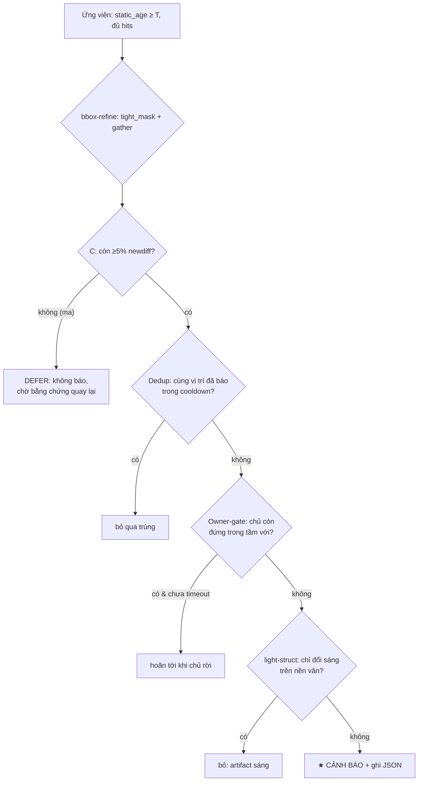

- **Evidence-gate (C)**: vật-frozen *luôn* có support; "ma" (đã hấp-thụ) có support ~0 → defer (an toàn, không nuốt vật thật).
- **Dedup-cooldown**: một vị-trí = một vật trong `--dedup-cooldown-s` giây, bền với candidate-churn.
- **Owner-gate**: chỉ báo khi *tầm-với của vật* đã vắng người `--owner-clear-s` giây; có `--owner-timeout-s` chặn hoãn vô-hạn; tự-tắt ở cảnh đông (`--crowd-n`).
- **Light-struct**: NCC [14] giữa patch và `clean_bg`; nền-có-vân + NCC cao = chỉ-đổi-sáng → bỏ.

### 4.7. Vòng đời vật & GUI (Object Lifecycle)

`app.py` (Hình 6) bọc pipeline thành sản phẩm tương tác. Một vật được **"đã lấy đi"** khi support `newdiff` tại hộp về ~0 trong `--taken-clear-s` giây (vị trí trở lại `clean_bg`).

**Hình 6 — Vòng đời vật trong GUI.**
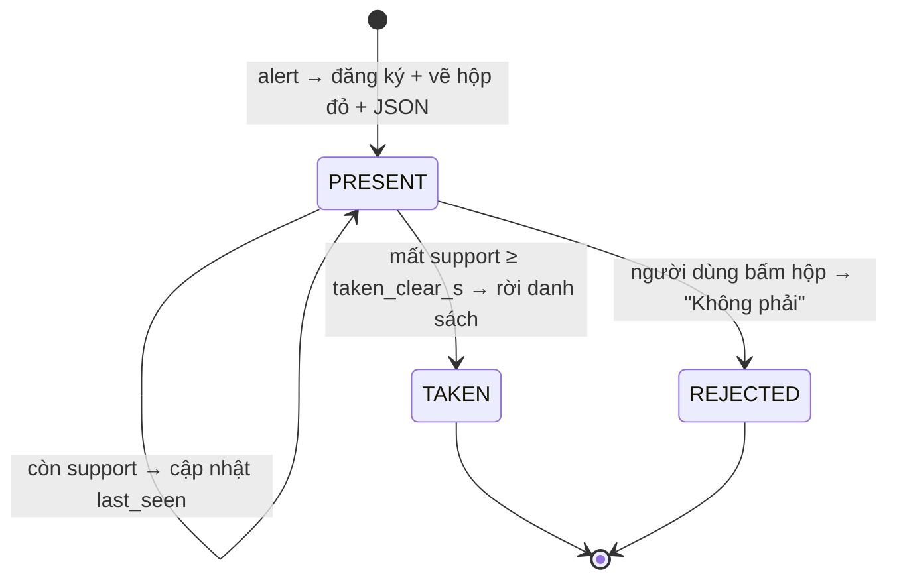

GUI: chọn **video** (hiện FPS xử lý) / **camera** (chọn FPS); vẽ hộp đỏ từ khung phát-hiện trở đi; **pop-up danh sách** vật đang xác nhận; **bấm hộp** để confirm/reject; **mỗi vật → 1 JSON** (`object_<id>.json`). Ví dụ thực (video6, vật #1 bị lấy đi ở khung 4144):

```json
{
  "id": 1, "status": "taken", "source": "video6.avi",
  "frame_alert": 3629, "t_alert_s": 121.09,
  "center": [187, 286], "bbox": [169, 276, 205, 297],
  "frame_taken": 4144, "t_taken_s": 138.27
}
```

`status` chuyển `present → taken` (mất support tại hộp) hoặc `present → rejected` (người dùng bác). Đây là đầu ra dùng để tích hợp với hệ cảnh báo/log ngoài.

---

## 5. Hiện thực & Tham số (Implementation & Parameters)

### 5.1. Backend & tăng tốc

- **BGS backend**: `pybgs` (ViBe C++, mặc định, nhanh nhất) hoặc `ControlledViBE` (numba JIT, nhận feedback hai-chiều).
- **Semantic**: `yolo26s-seg` xuất **OpenVINO FP32** [13] (tự export lần đầu; thiếu openvino → fallback PyTorch). **Không dùng INT8** (giảm recall người → hỏng nút thắt).
- **proc-width tách trục**: BGS/FSM ở 640px (ops/pixel nhanh), YOLO ở 960px (`--sem-proc-width`, chi tiết hơn) — cho camera ≥1080p.

### 5.2. Ba chế độ (`--mode`)

| `--mode` | Semantic→BGS | Backend | Ý nghĩa |
|---|---|---|---|
| **`no-feedback`** (mặc định) | không | ViBe C++ | nhanh nhất; loại **mọi motion-object** (moving + animate), giữ vật ở hậu kỳ |
| `instance-feedback` | một chiều (FG-protect) | ControlledViBE | YOLO bảo vệ vật-động khỏi ViBe nuốt |
| `dense-feedback` | hai chiều (BG+FG) | ControlledViBE | RT-SBS đầy đủ (SegFormer dense) |

### 5.3. Tham số điều chỉnh trade-off Recall ↔ Precision

Triết lý an ninh: **bỏ-sót-vật (false-negative) tệ hơn báo-nhầm (false-positive)** → mặc định lệch recall; **nhóm D nguy hiểm** (cơ chế *suppress*, có thể nuốt vật).

**Bảng 2 — Núm trade-off (default).**

| Nhóm | Cờ (default) | → tăng RECALL | → tăng PRECISION | Rủi ro |
|---|---|---|---|---|
| **A. Độ nhạy** | `--th-diff` (40) | giảm (bắt vật mờ) | tăng | — |
| | `--area-min`/`--area-max` (60/30000) | min↓ / max↑ | min↑ / max↓ (bỏ cửa) | — |
| | `--ts-static` (5s) | giảm (báo sớm) | tăng | +latency |
| | `--proc-width`/`--sem-proc-width` (640/960) | **tăng** (vật nhỏ rõ) | — | chậm |
| **B. Perception** | `--tau-animate` (0.3) | tăng | giảm (loại người mạnh) | ⚠ giảm→loại vật cạnh người |
| | `--person-overlap-max` (0) | giữ 0 | bật ~0.5 | ⚠ miss vật cầm/gần người |
| **C. Owner** | `--owner-clear-s`(3)/`--crowd-n`(10) | — | clear-s↑ | +trễ |
| **D. ⚠ Suppress sáng** | `--light-struct-ncc`(0.85) | tăng | giảm | **nuốt vật trên nền vân** |
| | `--relight-dv`(20)/`--heal-cov`(0.15) | tăng | giảm | **nuốt vật khi đổi sáng** |
| | `--alert-min-support`(0.05) | giảm | tăng | an toàn ở mức thấp |
| **E. Ghost** | `--heal-revealed`(1) | **0 = an ninh tối đa** | 1 | heal-zone nén vật vùng agent |
| | `--warmup-motion-mask`(1) | (chỉ thêm-FP) | — | nhiễu clean_bg→FP nơi khác |
| **F. Dedup** | `--dedup-dist`(40)/`-cooldown-s`(30) | dist↓ (tách vật gần) | dist↑ | ⚠ dist to→gộp 2 vật |

**Hai recipe đối cực:** *Max-recall* (an ninh): th-diff 30, area-min 30, ts-static 3s, tau-animate 0.45, nhóm-D nới, heal-revealed 0. *Max-precision*: th-diff 55, area-min 100, ts-static 9s, tau-animate 0.2, nhóm-D siết.

---

## 6. Thực nghiệm (Experiments)

### 6.1. Bộ dữ liệu & độ đo

**ABODA** [12] — 11 video gán nhãn (video1–11) + 2 video camera thực độ-phân-giải-cao không-nhãn (vid0103 đổ-rác, vid0355 ngõ-sau có xe). Tổng **13 video, 12 vật mục tiêu** (video6 có 2 vật).

- **Recall** = số vật GT được bắt / tổng vật GT (một vật là *hit* nếu tâm cảnh-báo nằm trong/sát hộp GT).
- **FP** = số sự kiện không khớp vật GT nào.
- Hai video `vid0103` và `vid0355` **không có GT chính thức** trong bộ chấm, nên được báo cáo như case-study/triển-khai thực và **không cộng vào FP=18** của 11 video GT.
- **Cấu hình**: *một cấu hình mặc định* cho cả 13 video; chỉ khác `--bg-learn-seconds` theo cảnh (vid0103=8s, vid0355=3s, còn lại 20s).
- **Phần cứng**: CPU Intel Tiger Lake (8 luồng), **không GPU**.

### 6.2. Kết quả chính

**Bảng 3 — Full-sweep ABODA (cấu hình mặc định, `--gather-px 0`).**

| Video | Sự kiện | HIT | FP | Ghi chú |
|---|---|---|---|---|
| video1/2/3 | 1/1/1 | ✓ | 0/0/0 | sạch |
| video4 | 1 | 1/1 | 0 | lần đầu test — bắt được |
| video5 | 2 | 1/1 | 1 | lần đầu test — bắt được + 1 FP |
| video6 | 3 | 2/2 | 1 | f780 đã hết (B); còn f5148 (đèn-tắt) |
| video7 | 4 | 1/1 | 3 | 2 lighting-residual + 1 FP riêng |
| video8 | 2 | 1/1 | 1 | 1 FP lẻ |
| video9 | 1 | 1/1 | 0 | dedup-cooldown trị báo-lặp |
| video10 | 2 | 1/1 | 1 | 1 FP lẻ |
| video11 | 12 | 1/1 | 11 | FP đám đông (>40 người) |
| **TỔNG (12 vật GT)** | | **Recall 12/12** | **FP 18** | |
| vid0103 | 3 | (no GT) | — | 1 case warmup-nhiễm đã phân tích |
| vid0355 | 2 | (no GT) | — | 1 máy giặt báo-lặp 2 vị trí |

**Recall 12/12** (bắt được mọi vật mục tiêu, gồm video4/5 lần đầu kiểm). FP dồn ở **video11 (11, đám đông)** và **video7 (3, lighting)**; 5 cảnh sạch 0 FP. Do backend `pybgs` có dao động nhỏ giữa các lần chạy, số FP ở cảnh đông có thể lệch khoảng ±1; bảng này lấy đúng sweep lưu trong `results_bcfix_g0/`.

**Precision theo ngữ cảnh.** Precision tổng = 12/(12+18) ≈ **40%**. Nhưng FP **không phân bố đều** — chúng tụ ở hai cảnh *biết trước là khó*: bỏ **video11** (đám đông, trần perception) còn 7 FP/10 cảnh → precision **63%**; bỏ thêm **video7** (lighting-ramp) còn **4 FP/9 cảnh → precision 75%**. Vì hệ **thiên-recall cho an ninh**, FP còn lại thuộc loại **dễ hậu-kiểm** (người/đổi-sáng) — chấp nhận được hơn nhiều so với **bỏ-sót-vật** (recall = 100%). Đây là đánh đổi có chủ đích, không phải khuyết điểm ngẫu nhiên.

### 6.3. Audit mật độ người và foreground thật của cảnh

Phần này không dùng `occupancy` của YOLO như "mật độ thật". Chúng tôi tách ba đại lượng:

- **Người thực tế ước lượng bằng mắt**: audit trực quan trên các frame đại diện/case-study; không phải annotation GT đầy đủ từng frame.
- **YOLO count**: số instance `animate` mà detector nhìn thấy ở mẫu 1Hz (`yolo26n`, `imgsz=640`, `conf=0.15`) — dùng để chỉ ra giới hạn perception.
- **Clean-bg foreground**: tỷ lệ pixel khác nền sạch, tính độc lập với YOLO: `abs(gray-clean_bg) >= 40`, morph-open 3x3, lấy mẫu 1Hz sau warmup. Đại lượng này phản ánh mức "khác nền" thật theo camera, nhưng **có cả người, vật, bóng và đổi sáng**, nên không đồng nghĩa với mật độ người.

**Bảng 4 — Mật độ cảnh: audit bằng mắt vs detector vs foreground khác nền.**

| Cảnh | Người/vật thực tế ước lượng | YOLO animate count (TB/max) | Clean-bg FG % (TB/P95/max) | Đọc |
|---|---:|---:|---:|---|
| **video11** (sảnh đông) | >40 người ở peak | 10.5 / 15 | 4.39 / 5.11 / 5.49 | Detector sót/ghép người xa; đây là trần perception gây 11 FP |
| **vid0355** (camera 1080p+) | 1 xe gần + máy giặt/vài người | 2.4 / 5 | 4.07 / 7.13 / 7.94 | Ít người nhưng vật/xe gần cam chiếm nhiều pixel |
| **video6** (lobby) | thường vắng, có đoạn đông cục bộ | 0.2 / 5 | 9.77 / 36.42 / 37.42 | Peak foreground cao do người/đổi sáng cục bộ; liên quan FP đèn-tắt |
| **video7** (phòng học) | ít người, không phải cảnh đông | 0.1 / 2 | 44.27 / 64.17 / 67.15 | Foreground khác nền rất cao chủ yếu vì ramp/đổi sáng, không phải mật độ người |
| **video8** (phòng học) | ít người, vật lớn trên bàn | 0.1 / 2 | 42.89 / 55.91 / 56.52 | Nền/ánh sáng lệch mạnh làm FG pixel cao dù cảnh không đông |

Kết luận: **mật độ người thực tế, số người detector thấy, và foreground pixel khác nền là ba đại lượng khác nhau**. Với AOD, `clean-bg FG%` hữu ích để giải thích cảnh khó do nền/ánh sáng; `YOLO count` hữu ích để giải thích lỗi perception; còn "mật độ người thật" chỉ có thể chính xác nếu có annotation người thủ công. Trong báo cáo này, các số người thật là audit trực quan, còn các số pixel được lưu ở `metrics/scene_foreground_occupancy_1fps.json`.

### 6.4. Nghiên cứu ablation

**Bảng 5 — Đóng góp từng cơ chế (đo trên cảnh tương ứng).**

| Cơ chế | Hiệu ứng đo được |
|---|---|
| **relight** (tune) | video7 21→2 FP, video6 7→5 FP — không tốn tốc độ |
| **light-struct** (NCC) | bỏ FP góc-cầu-thang video6 (NCC 0.96), 0 mất recall |
| **C** evidence-gate | video6 8→4 FP (diệt 3 ma sàn/cột), 0 miss toàn ABODA |
| **B** motion-warmup | video6 f780 (warmup-ghost người) biến mất |
| **heal-revealed** | trị car-ghost: phát hiện xe baked 10.7–12.1% `clean_bg`, heal khi rời |
| **dedup-cooldown** | video9 báo-lặp 2→1 |
| **yolo26s** (vs nano) | phục hồi recall người cho owner-gate |

**Đã thử & LOẠI** (ghi lại để khỏi lặp): *A — regional patch-vs-ring*: vô hiệu vì FP-mục-tiêu lúc alert có `newdiff=0` (đã bị hấp-thụ) → không gì để đo. *targeted-B*: ngưỡng vô-căn-cứ (overfit) **và** không khử được FP (seed từ correction khác) → revert.

### 6.5. Tốc độ (Runtime)

Tăng tốc YOLO-seg trên CPU (độ chính xác **không đổi**, events identical):

**Bảng 6 — Benchmark backend (FPS).**

| Backend | video7 | video11 |
|---|---|---|
| PyTorch `.pt` | 5.6 | 4.6 |
| ONNX FP32 | 6.5 (1.16×) | 4.9 (1.07×) |
| **OpenVINO FP32 (mặc định)** | **8.4 (1.50×)** | **7.2 (1.57×)** |

Thông lượng tổng: **~5 FPS** (chạy batch, có contention) đến **~7–9 FPS** (single-run sạch) trên CPU laptop. Nghẽn chính = YOLO-seg mỗi khung; với GPU sẽ lên 30+ FPS (gần realtime).

### 6.6. Phân tích trường hợp có minh họa (Case Studies)

Các hình dưới dùng hai nguồn: ảnh cảnh-báo chuẩn từ `results_bcfix_g0/` (đúng pipeline hiện tại) và mask gỡ-lỗi từ `debug/diag` (`frame`, `clean_bg`, `newdiff`, `moving`, `static_fg`, `tight`, `semantic`, `keep`) để giải thích *vì sao* mỗi trường hợp đúng/sai.

#### 6.6.1. Luồng mask của một phát hiện ĐÚNG (walkthrough)

**Hình 7 — Tám mask của một phát hiện sạch (video8, máy giặt bỏ lại).**

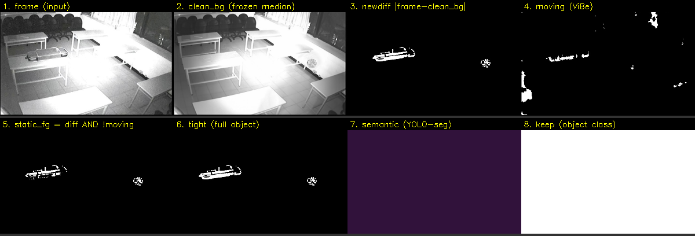

Đọc theo thứ tự: **(1) frame** hiện tại vs **(2) clean_bg** đóng-băng → **(3) newdiff** làm nổi *đúng đường-viền vật* (máy giặt + một blob nhỏ); **(4) moving** (ViBe) chỉ bắt nhiễu/chuyển-động lác đác — vật *đứng yên* nên không nằm trong moving; **(5) static_fg = newdiff ∧ ¬moving** lọc còn vật tĩnh; **(6) tight** giữ *toàn-hình* vật để tinh-chỉnh hộp; **(7) semantic** (YOLO-seg) ở vùng vật **tím/thấp** (không phải người) nên **(8) keep** = trắng (giữ). Vật qua mọi cổng → cảnh báo. Đây là một **HIT riêng lẻ** trong video8; toàn video8 vẫn có 1 FP lẻ như Bảng 3.

#### 6.6.2. Trường hợp TỐT NHẤT

**Hình 8 — Năm phát hiện sạch (HIT), 0 báo-nhầm.**

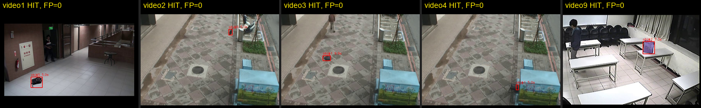

video1/2/3/4/9 là các cảnh **mỗi video chỉ có một event và event đó khớp GT** (`FP=0`). Điểm chung: vật rõ, tương phản đủ với nền, chủ rời đi rõ ràng, và cảnh không có đám đông đứng lâu che lấp vật. Đây là chế-độ-vận-hành lý tưởng của hệ thống: vật trung-bình-tới-lớn, nền ổn định, đường rời đi của chủ tách khỏi vùng vật.

#### 6.6.3. Trường hợp TỆ NHẤT (kèm phân tích mask)

**(a) Đám đông — trần perception.**

**Hình 9 — video11 (>40 người): alert thật từ `results_bcfix_g0/video11` và mask giải thích FP đám đông.**

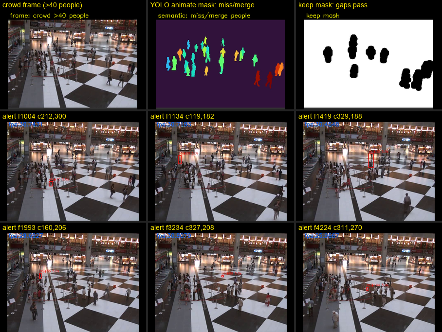

Ba panel đầu là mask chẩn đoán đại diện; sáu panel sau là alert thật lấy từ `results_bcfix_g0/video11` (các frame f1004, f1134, f1419, f1993, f3234, f4224). Run hiện tại sinh **12 event** ở video11: **1 HIT + 11 FP**. Mask `semantic` cho thấy detector chỉ bắt được một phần đám đông (người xa bị sót/ghép khi che nhau), nên một số vùng người không bị gán `animate` đủ mạnh. Các vùng này đi qua `keep`, đứng tương đối yên đủ 5s, rồi thành FP trên người hoặc cụm người. Đây là lỗi ở tầng perception; các heuristic hậu kỳ có thể giảm vài trường hợp nhưng khó triệt để nếu detector không nhìn thấy người.

**(b) Vật rất to → báo-lặp.**

**Hình 10 — vid0355: một máy giặt sinh HAI cảnh báo.**

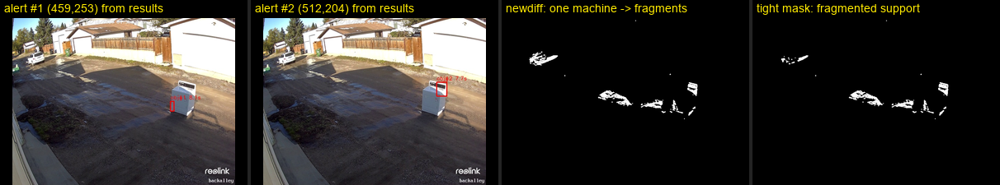

`newdiff`/`tight` cho thấy máy giặt to bị **vỡ thành nhiều mảnh** (phản chiếu/độ-tương-phản không-đều). Hai mảnh trong run chuẩn có tâm **(459,253)** và **(512,204)**, cách nhau khoảng **72 px > `--dedup-dist` 40** → dedup không gộp → một vật sinh hai hộp. Hướng sửa: dedup-dist **co giãn theo kích thước vật** (`max(40, k·√area)`).

**(c) Đổi-trạng-thái-cảnh cục bộ (đèn tắt).**

**Hình 11 — video6 f5148: một góc bị tắt đèn → FP.**

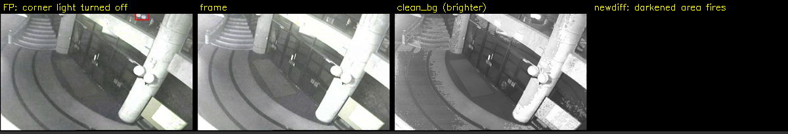

`clean_bg` (học lúc góc còn sáng) **sáng hơn** frame hiện tại; khi đèn góc tắt, vùng đó **tối đi** → `newdiff` cháy *cục bộ* (không phải toàn-cục nên relight không kích hoạt; không phủ rộng nên light-comp bỏ qua; nền-vân-ít nên light-struct không chắc). Pipeline coi "góc tối đi + tĩnh + không-người" = vật → FP. Thuộc **giới hạn cố hữu** đổi-trạng-thái-cảnh (§7).

**(d) Warmup bị nhiễm (người hiện diện suốt lúc học nền).**

**Hình 12 — vid0103: nguyên nhân — người đổ rác đứng suốt 8s warmup.**

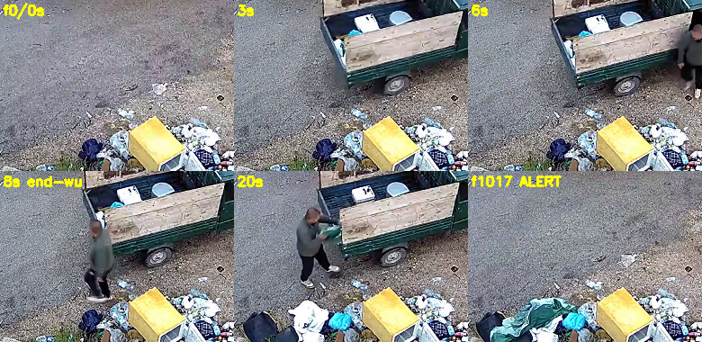

**Hình 13 — vid0103: phân tích mask của FP (302,212).**

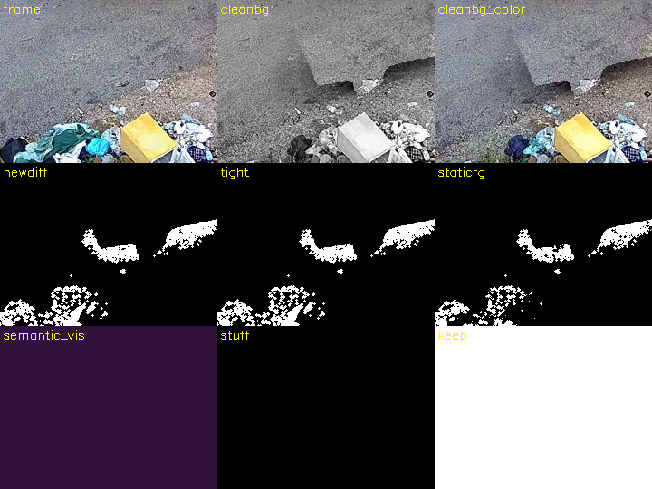

Trong 8s học nền, một người **đứng gần-bất-động** đổ/bới rác (Hình 12). Median **nướng người+bóng** thành **vùng TỐI** trong `clean_bg` (Hình 13, ô `clean_bg`: vệt tối lưỡi-liềm). Khi người rời đi, đường-trống **sáng hơn** nền-baked-tối → `newdiff` cháy (42.5% support) → tĩnh → **FP** (302,212). `staticfg`/`tight` xác nhận blob thật; nên evidence-gate **C giữ đúng** (đây là diff thật, lỗi ở *clean_bg sai* chứ không phải FSM). B (motion-mask) **không cứu** vì người *đứng yên* (framediff<20). → cần **ảnh-nền-trống** hoặc cửa-sổ-warmup-sạch.

---

## 7. Thảo luận & Giới hạn (Discussion & Limitations)

**Giới hạn cố hữu** (không heuristic nào trong khung hiện tại trị được):

1. **Trần perception (đám đông).** Model bỏ-sót/ghép người ở xa (video11: thấy ~10/40) → FP đám đông *cứng*. Lối ra = model to/open-vocabulary, không phải logic.
2. **Đổi-trạng-thái-cảnh runtime** (mở cửa, ghế xê dịch, đèn-cố-định bật). Vùng đó *static + khác clean_bg + không-người* ⇒ trông y vật-bỏ-quên; pipeline **không phân biệt "cảnh đổi" với "vật để lại"**. → cần `stuff-reject` (dense + model tốt) / ROI-mask / scene-classifier.
3. **Warmup bị nhiễm** (người/vật *bất-động* hiện diện suốt giai đoạn học nền). median nướng họ vào `clean_bg` → khi rời → báo-nhầm (vid0103). B chỉ trị transient *ĐỘNG*; cách triệt để = nạp **ảnh-nền-trống** chụp sẵn hoặc chọn cửa-sổ-warmup lúc cảnh trống.

**Rủi ro thiết kế.** Nhóm cơ-chế-*suppress* (D) có thể **nuốt vật thật** (false-negative) — vì vậy mặc định để bảo-thủ; cơ chế evidence-gate (C) được thiết kế *defer* (không xóa vĩnh viễn) để an toàn recall. Cơ chế B perturbs `clean_bg` nên có thể đẻ FP khó-lường ở cảnh khác ⇒ khuyến nghị **A/B test trên footage thật** trước khi triển khai.

---

## 8. Kết luận (Conclusion)

Chúng tôi xây dựng một hệ thống AOD **thời-gian-thực trên CPU** dựa trên **nền-kép cố định** + **FSM tuổi-tĩnh** + **cổng ngữ nghĩa loại mọi đối-tượng-chuyển-động**, kế thừa khung RT-SBS [3]. Bốn lớp cập-nhật-nền/ánh-sáng và bốn cổng cảnh-báo — đặc biệt **evidence-gate (C)** và **motion-aware warmup (B)** — nâng độ chính xác mà vẫn **thiên về recall** cho an ninh. Trên ABODA [12], hệ thống đạt **Recall 12/12, FP 18** ở **~5–9 FPS CPU**. Phần báo-nhầm còn lại tập trung ở **đám đông** (trần perception) và **đổi-trạng-thái-cảnh** (giới hạn bài toán). Hướng phát triển: detector open-vocabulary để nhận đúng *lớp vật mục tiêu* và bắt sự kiện *"chủ rời đi"*; mô-đun ROI/scene-classifier cho đổi-trạng-thái-cảnh; và nạp ảnh-nền-trống cho cảnh warmup-nhiễm.

---

## Tài liệu tham khảo (References)

[1] O. Barnich, M. Van Droogenbroeck. "ViBe: A universal background subtraction algorithm for video sequences." *IEEE Transactions on Image Processing*, 20(6):1709–1724, 2011.

[2] M. Van Droogenbroeck, O. Paquot. "Background subtraction: Experiments and improvements for ViBe." *CVPR Workshops*, 2012.

[3] A. Cioppa, M. Van Droogenbroeck, M. Braham. "Real-Time Semantic Background Subtraction." *IEEE ICIP*, 2020.

[4] M. Braham, S. Piérard, M. Van Droogenbroeck. "Semantic background subtraction." *IEEE ICIP*, 2017.

[5] C. Stauffer, W.E.L. Grimson. "Adaptive background mixture models for real-time tracking." *IEEE CVPR*, 1999.

[6] J. Redmon, S. Divvala, R. Girshick, A. Farhadi. "You Only Look Once: Unified, Real-Time Object Detection." *IEEE CVPR*, 2016.

[7] G. Jocher, A. Chaurasia, J. Qiu, et al. "Ultralytics YOLO (instance segmentation)." 2023. https://github.com/ultralytics/ultralytics

[8] E. Xie, W. Wang, Z. Yu, A. Anandkumar, J.M. Alvarez, P. Luo. "SegFormer: Simple and Efficient Design for Semantic Segmentation with Transformers." *NeurIPS*, 2021.

[9] F. Porikli, Y. Ivanov, T. Haga. "Robust abandoned object detection using dual foregrounds." *EURASIP Journal on Advances in Signal Processing*, 2008.

[10] Y. Tian, R.S. Feris, H. Liu, A. Hampapur, M.-T. Sun. "Robust Detection of Abandoned and Removed Objects in Complex Surveillance Videos." *IEEE Transactions on Systems, Man, and Cybernetics — Part C*, 41(5):565–576, 2011.

[11] T. Bouwmans. "Traditional and recent approaches in background modeling for foreground detection: An overview." *Computer Science Review*, 11–12:31–66, 2014.

[12] K. Lin, S.-C. Chen, C.-S. Chen, D.-T. Lin, Y.-P. Hung. "Abandoned Object Detection via Temporal Consistency Modeling and Back-Tracing Verification for Visual Surveillance." *IEEE Transactions on Information Forensics and Security*, 10(7):1359–1370, 2015. (Bộ dữ liệu **ABODA**.)

[13] Intel Corporation. "OpenVINO Toolkit: Open Visual Inference and Neural network Optimization." https://docs.openvino.ai

[14] J.P. Lewis. "Fast Normalized Cross-Correlation." *Vision Interface*, 1995.

---

*Báo cáo này mô tả hệ thống ở commit hiện hành của repo. Số liệu thực nghiệm trong `results_bcfix_g0/`; audit detector-occupancy trong `metrics/aboda_instance_occupancy_1fps.json`; audit foreground khác-nền trong `metrics/scene_foreground_occupancy_1fps.json`. Quy trình phát triển chi tiết (các hướng đã thử & loại) trong [`solution_analysis.md`](solution_analysis.md).*
