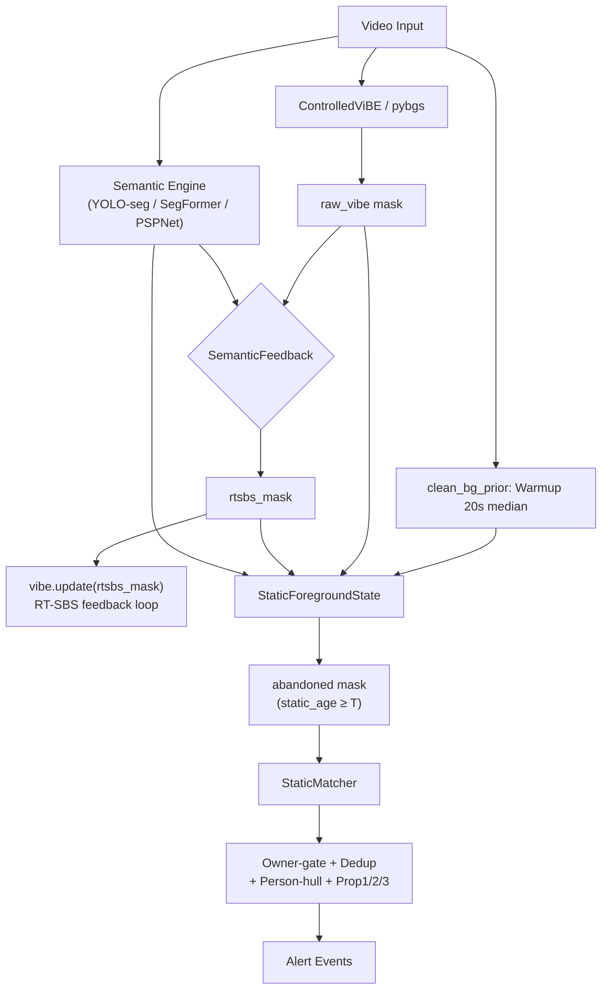

# Phân tích chi tiết code demov2 — RT-SBS faithful + FSM AOD

> **Scope**: toàn bộ `demov2/` — 900 dòng orchestrator + 7 module core + 5 tool scripts.
> **Dataset**: ABODA (video 1,2,3,7,8,11). **Eval**: `eval/summary.json`.

---

## 1. Kiến trúc tổng quan



**Triết lý**: Giữ đúng vòng RT-SBS gốc (ViBe + decision table + dense semantic feedback), gắn thêm nhánh AOD riêng dùng `clean_bg` cố định.

**3 mode preset**:
| Mode | BGS | Feedback | Motion gate | Semantic |
|------|-----|----------|-------------|----------|
| `no-feedback` | pybgs C++ | ❌ | raw-vibe | YOLO-seg (chỉ trừ người) |
| `instance-feedback` | ControlledViBE | ✅ 1 chiều (FG-protect) | raw-vibe | YOLO-seg |
| `dense-feedback` | ControlledViBE | ✅ 2 chiều (BG+FG) | rtsbs | SegFormer dense |

---

## 2. Phân tích từng module

### 2.1. `run_rtsbs_aod.py` — Orchestrator (900 dòng)

**Chức năng**: Parse args → init tất cả component → main loop → event output.

**Nhận xét**:

> [!WARNING]
> **God-file anti-pattern**: 900 dòng trong 1 file, gộp 5 wrapper class (`OnlineSegFormer`, `OnlinePSPNet`, `OnlineYoloSeg`, `CrowdEstimator`, `PybgsViBe`) + `parse_args()` 175 dòng / 70+ tham số + main loop 240 dòng. Rất khó maintain và test.

- **70+ CLI args**: configuration space quá lớn, nhiều tham số chỉ dùng cho 1 mode cụ thể. Không có validation chéo (vd `--stuff-reject` + `online-yoloseg` = vô nghĩa vì YOLO-COCO không có stuff class).
- **Main loop (L662–881)**: logic alert (L756–836) lồng 4 cấp `if`, trộn lẫn bbox refinement + dedup + owner-gate + person-overlap trong 1 block → rất khó trace flow.
- `read_frame()` (L49–58): mở/đóng `VideoCapture` mỗi lần đọc 1 frame → **chậm không cần thiết** (chỉ dùng cho initial semantic).

**Điểm tốt**:
- Mode preset system (`--mode`) gói 3 trục config thành 1 lựa chọn → UX tốt.
- Debug output đầy đủ (`--save-masks-every`): 14 loại mask → dễ debug visual.
- Crowd estimator + smoothing window → adaptive behavior.

---

### 2.2. `core/controlled_vibe.py` — ControlledViBE (169 dòng)

**Chức năng**: Port CPU của ViBE GPU gốc RT-SBS, cho phép tách `segmentation()` và `update()` để chèn semantic feedback.

**Nhận xét**:

| Aspect | Đánh giá |
|--------|----------|
| Numba JIT | ✅ `_vibe_segment_njit` parallel + early-exit, ~10× vs cv2 loop |
| Fallback | ✅ Non-numba path dùng `cv2.absdiff` + `cv2.transform` |
| Init | ✅ Đúng RT-SBS: exact copy + noisy samples |
| Update | ⚠️ Pre-computed schedule (`update_vector`, `position`) rolled mỗi frame — đúng logic nhưng **`np.roll` trên mảng lớn mỗi frame = chi phí ẩn** |

> [!NOTE]
> **Update schedule concern**: `update_vector` có size = H×W pixels. Mỗi frame gọi `np.roll()` 4 lần trên các mảng lớn (L151–154). Với 480p → 345K elements × 4 rolls = chi phí đáng kể. RT-SBS GPU gốc dùng random per-pixel trên GPU nên không có vấn đề này.

- **Neighbor update** (L165–168): `dst_y/dst_x = clip(ys + neighbor_row)` — đúng ViBE spec (propagate to neighbor), nhưng dùng `pos_neighbor = np.roll(self.position, ...)` tạo correlation giữa self-position và neighbor-position → **không hoàn toàn independent random** như paper.

---

### 2.3. `core/semantic_feedback.py` — RT-SBS Decision Table (98 dòng)

**Chức năng**: Implement luật BG/FG của RT-SBS dựa trên semantic map 16-bit.

**Nhận xét**:

> [!IMPORTANT]
> **Đây là module trung thành nhất với paper RT-SBS.** Logic decision table đúng:
> - `rule_BG = sem ≤ τ_BG` (pixel không phải moving object → force BG)
> - `rule_FG = (sem − model) ≥ τ_FG × 256` (semantic tăng đột biến → force FG)
> - Color-reuse inter-frame: `tau_bg_star` / `tau_fg_star` (decision table B/S/C → D_t)

- **Sparse instance map handling** (L52–57): `enable_bg_rule=False` cho YOLO-seg (sem=0 không phải "confident BG" → abstain). Đây là adaptation quan trọng và đúng.
- `_update_semantic_model()` (L92–97): random 1/256 update chỉ tại BG pixels — đúng paper.
- **Vấn đề**: `color_map` (L49) lưu toàn bộ frame BGR mỗi lần có semantic → **tốn RAM** (3× frame size) chỉ để so color diff ở frame tiếp.

---

### 2.4. `core/static_state.py` — StaticForegroundState (301 dòng)

**Chức năng**: FSM per-pixel: clean_bg diff → static FG → age → semantic gate → abandoned.

**Đây là module quan trọng nhất cho AOD và cũng phức tạp nhất.**

**Logic flow**:
```
gray = cvtColor(frame, GRAY)
    ↓
[relight check] → nếu đang rebuild clean_bg → return zeros
    ↓
newdiff = |gray − clean_bg| ≥ th_diff → morphOpen
    ↓
[light_comp] nếu coverage > heal_cov → absorb vào clean_bg (trừ persist)
    ↓
framediff = |gray − prev_gray| ≥ th_diff → dilate
    ↓
moving = framediff (hoặc external rtsbs/raw-vibe mask)
static_fg = newdiff AND NOT moving
    ↓
[motion_to_static latch] _moved |= dilate(moving); clear after sustained BG
    ↓
[semantic gate] animate ≥ τ → reject; object ≥ τ → keep; stuff ≥ τ → reject
valid = static_fg AND keep AND NOT stuff AND (moved if prop3)
    ↓
static_age[valid] += dt;  age[gone] = 0;  age[decaying] -= decay×dt
abandoned = (static_age ≥ t_static_s)
```

**Nhận xét chi tiết**:

| Feature | Đánh giá |
|---------|----------|
| Relight (ngày↔đêm) | ✅ Port từ demov1, dùng V+S divergence + hold counter |
| Light-comp (heal) | ✅ Adaptive alpha (sáng=1.0, tối=0.05) |
| Persist-protect | ✅ Chặn slow-update nuốt vật tĩnh |
| Motion-to-static latch (Prop3) | ✅ Ý tưởng đúng: vật phải "được mang vào" trước khi static |
| Tight mask | ✅ `fgbg AND NOT framediff` → giữ full object shape cho bbox |

> [!WARNING]
> **Race condition trong relight**: `_relight_step()` trả `True` ngay khi phát hiện diverging (L136), khiến toàn bộ frame bị skip (`return self._zeros_result()`). Nếu lighting thay đổi từ từ (gradual), `_switch_count` increment nhưng **mỗi frame diverging đều bị drop** → miss real events trong window đó.

> [!WARNING]
> **`clean_bg` update leak**: L276–283, update condition = `(NOT static_fg) OR stuff_b` AND `NOT protect_persist`. Nhưng `static_fg = newdiff AND NOT moving` — nếu ViBE moving gate flickering (người đi qua nhanh), một pixel vật tĩnh có thể bị moving=True nhất thời → `static_fg=False` → **clean_bg bị update tại pixel vật** → vật dần bị absorb.

---

### 2.5. `core/static_matching.py` — StaticMatcher (113 dòng)

**Chức năng**: Gom blob từ abandoned mask, track qua frame bằng IoU + distance.

**Nhận xét**:
- **Greedy matching** (L77–95): O(cands × blobs) greedy, không phải Hungarian → suboptimal khi nhiều candidate gần nhau. Chấp nhận được vì typical candidate count < 10.
- **EMA bbox smoothing** (L90): `0.7 * old + 0.3 * new` — hardcoded, giúp ổn định nhưng làm chậm phản ứng với shape change.
- **`max_cands=100`**: sort theo `first_seen` rồi cắt → ưu tiên candidate cũ. Đúng cho AOD (vật cũ quan trọng hơn).
- **Thiếu**: Không có confidence score per candidate; không có track-level semantic voting.

---

### 2.6. `core/clean_bg_prior.py` — Warmup Background (51 dòng)

**Nhận xét**: Đơn giản, đúng. Median warmup qua N sampled frames → robust hơn mean.

> [!NOTE]
> Dùng `cap.set(CAP_PROP_POS_FRAMES, fi)` để seek → **không reliable** trên một số codec (seek to nearest keyframe, không exact). Tốt hơn nên đọc tuần tự và skip.

---

### 2.7. `core/semantic_lut.py` — Class Lookup (184 dòng)

**Nhận xét**: Clean, well-structured.
- `MOVING_OBJECT_TERMS`, `STATIC_OBJECT_TERMS`, `STUFF_BACKGROUND_TERMS`: 3 tập từ vựng phủ rộng.
- `norm_label()`: xử lý `/`, `,`, `-`, `_` + split multi-word → robust matching.
- **Hạn chế**: ADE20K-150 không có `umbrella/handbag` → SegFormer KHÔNG bao giờ cho positive object signal cho ô/túi trên ABODA. YOLO-COCO có `umbrella` nhưng confidence thấp cho ô gập nhỏ.

---

### 2.8. `core/dense_semantic.py` — Dense Map Reader (80 dòng)

**Nhận xét**: Hỗ trợ `.png/.tif/.npy/.npz`, auto-resize, strict/sequential index. Clean code.

---

## 3. Phân tích kết quả Evaluation

Từ `eval/summary.json` (6 video × 2 mode):

| Video | Mode | HIT | FP | Events | Latency (s) | FPS |
|-------|------|-----|----|--------|-------------|-----|
| video1 | no-feedback | ✅ | 1 | 2 | 0.6 | 10.7 |
| video1 | instance-feedback | ❌ | 0 | 0 | — | 8.0 |
| video2 | no-feedback | ✅ | 0 | 1 | 3.5 | 10.9 |
| video2 | instance-feedback | ✅ | 0 | 1 | 3.6 | 7.8 |
| video3 | no-feedback | ✅ | 0 | 1 | -12.0 | 10.8 |
| video3 | instance-feedback | ✅ | 0 | 1 | -9.8 | 7.7 |
| video7 | no-feedback | ✅ | 3 | 5 | -13.1 | 10.4 |
| video7 | instance-feedback | ✅ | 2 | 3 | -7.3 | 7.2 |
| video8 | no-feedback | ✅ | 4 | 5 | -5.5 | 0.9 |
| video8 | instance-feedback | ✅ | 4 | 5 | -5.5 | 7.6 |
| video11 | no-feedback | ✅ | 11 | 12 | -33.6 | 10.3 |
| video11 | instance-feedback | ✅ | 15 | 16 | -35.2 | 7.4 |

### Tổng hợp:

| Mode | HIT | Total Objects | FP tổng | Avg FPS |
|------|-----|---------------|---------|---------|
| **no-feedback** | 6/6 | 6 | **19** | 9.0 |
| **instance-feedback** | 5/6 | 6 | **21** | 7.6 |

> [!CAUTION]
> **instance-feedback MISS video1** (0 events) — RT-SBS feedback FORCE-FG lên vùng person → ViBE giữ person area as FG → khi person rời, ViBE vẫn cho FG → moving gate không tắt → vật không bao giờ chuyển sang static. **Feedback 1 chiều gây hại ở cảnh đơn giản.**

### Key observations:

1. **Latency âm (< 0)**: 4/6 video có latency **âm** → hệ thống báo TRƯỚC `abandon_frame` GT. Nghĩa là `ts_static=5s` + pipeline nhanh hơn annotation. Đây là **cảnh-báo-sớm**, không phải lỗi.

2. **video8 no-feedback: 0.9 FPS** — anomaly rõ. Có thể do `pybgs` ViBe C++ initialization chậm hoặc video8 resolution/codec đặc biệt.

3. **video11 FP explosion**: 11–15 FP ở cảnh đông. Gốc: YOLO-nano bỏ sót người đứng im trong đám đông → static + not-animate → false abandoned.

4. **instance-feedback không hơn no-feedback**: FP cao hơn (21 vs 19), miss 1 video, chậm hơn 16%. **Feedback vào ViBE không giúp AOD, còn gây hại.**

---

## 4. Các vấn đề chính (tổng hợp)

### 🔴 Nghiêm trọng

| # | Vấn đề | File | Impact |
|---|--------|------|--------|
| 1 | **instance-feedback miss video1** — FG-protect giữ person area quá lâu, vật không chuyển static | `semantic_feedback.py` L59 | Miss detection |
| 2 | **clean_bg leak khi ViBE flicker** — moving gate nhất thời True → static_fg False → clean_bg update tại pixel vật | `static_state.py` L276 | Vật dần bị absorb |
| 3 | **God-file 900 dòng** — untestable, unmaintainable | `run_rtsbs_aod.py` | Engineering debt |

### 🟡 Quan trọng

| # | Vấn đề | File | Impact |
|---|--------|------|--------|
| 4 | **Relight skip ALL frames** khi diverging trước hold threshold | `static_state.py` L136 | Miss events during lighting transition |
| 5 | **np.roll overhead** mỗi frame trên H×W array | `controlled_vibe.py` L151 | Performance (est. 5-15% of frame time) |
| 6 | **70+ CLI args** không validated chéo | `run_rtsbs_aod.py` | Config errors silent |
| 7 | **Video seek** dùng `CAP_PROP_POS_FRAMES` (unreliable) | `clean_bg_prior.py` L37 | Potential wrong warmup frames |
| 8 | **Greedy matching** không Hungarian | `static_matching.py` | Suboptimal in crowded scenes |

### 🟢 Minor

| # | Vấn đề | Impact |
|---|--------|--------|
| 9 | `read_frame()` mở/đóng VideoCapture mỗi lần | Slow init |
| 10 | `color_map` lưu full BGR frame mỗi semantic step | RAM waste |
| 11 | Hardcoded EMA 0.7/0.3 bbox smoothing | Inflexible |
| 12 | `CrowdEstimator` dùng blob count (không phải detection count) | Inaccurate density |

---

## 5. So sánh với demov1

| Tiêu chí | demov1 | demov2 | Verdict |
|----------|--------|--------|---------|
| HIT rate ABODA | 4/4 (7,8,3,11) | 5/6 (miss video1 instance) | demov1 ✅ |
| FP (video11) | 12 | 11–15 | ≈ ngang |
| FP (tổng 6 video) | N/A (chỉ 4) | 19–21 | — |
| Dedup 1-báo/vật | ✅ | ✅ (đã thêm) | ngang |
| Owner-gate | ✅ + local mode | ✅ + Prop2 local + timeout | demov2 ✅ |
| RT-SBS faithful | ❌ | ✅ decision table + feedback | demov2 ✅ |
| Code structure | 1 god-file | 1 god-file + 7 modules | demov2 nhỉnh |
| FPS CPU | 7–9 | 7–11 (no-feedback) | ≈ ngang |
| Relight | ✅ | ✅ (port từ demov1) | ngang |
| Motion-to-static (Prop3) | ❌ | ✅ | demov2 ✅ |

---

## 6. Nhận xét tổng thể

### Điểm mạnh
1. **Modular core**: 7 module tách rõ responsibility (ViBE, feedback, FSM, matcher, semantic LUT, bg prior, dense reader).
2. **Flexible mode system**: 3 preset + `custom` mode cover nhiều experimental axis.
3. **Prop1/2/3 innovations**: motion-to-static latch, person-hull punch, local owner-gate with timeout — ý tưởng tốt cho crowded scenes.
4. **Debug output phong phú**: 14 loại mask + semantic vis → dễ diagnose.
5. **RT-SBS faithfulness**: Decision table + color-reuse + semantic model update đúng paper.

### Điểm yếu
1. **Feedback RT-SBS KHÔNG giúp AOD**: instance-feedback miss video1, FP không giảm. Dense-feedback cần GPU (SegFormer ~2 FPS). **Kết luận: RT-SBS feedback là overhead không mang lại giá trị cho bài toán abandoned object.**
2. **Orchestrator quá phức tạp**: 900 dòng, 70+ params, logic alert lồng sâu → khó test, khó extend.
3. **YOLO-nano bottleneck ở cảnh đông**: Bỏ sót 25/33 người → FP cứng, không trị bằng logic.
4. **Thiếu unit test**: Không có test nào trong repo cho demov2.
5. **Config coupling**: Nhiều tham số tương tác ngầm (vd `tau_animate` × `dilate_animate` × `person_hull` × `person_overlap_max`).

### Khuyến nghị

> [!TIP]
> 1. **Bỏ feedback mode**: `no-feedback` là mode tốt nhất (HIT 6/6, FP thấp hơn, nhanh hơn). Giữ code feedback cho nghiên cứu nhưng default = off.
> 2. **Tách orchestrator**: Extract `AlertDecisionEngine` class chứa logic dedup + owner-gate + person-hull + bbox-refine (hiện 80 dòng inline).
> 3. **Fix clean_bg leak**: Thêm `persist_protect` vào update condition, hoặc dùng hysteresis (pixel phải moving liên tục N frame mới cho update).
> 4. **Config profiles**: Thay 70+ args bằng YAML config files (`aboda_sparse.yaml`, `aboda_crowded.yaml`, ...).
> 5. **GPU person detector**: FP cảnh đông là bottleneck cứng → cần YOLO-L hoặc RT-DETR trên GPU cho person segmentation.
