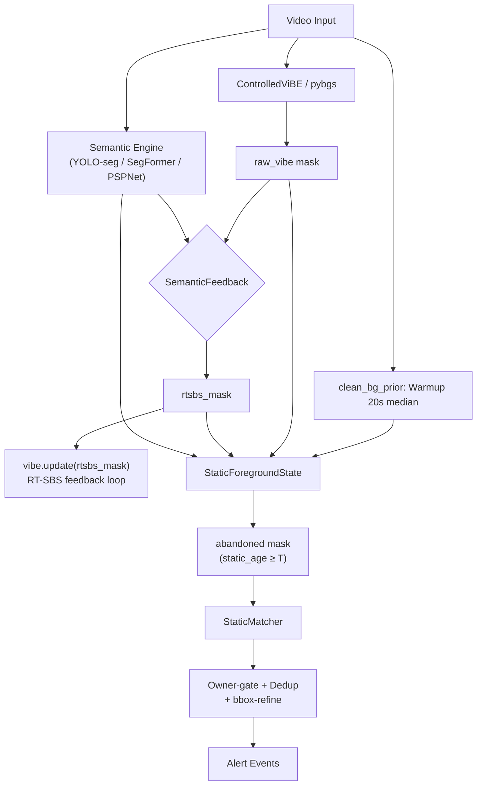

# Solution analysis — Realtime Abandoned-Object Detection

Phân tích chi tiết giải pháp + **quá trình phát triển** (vì sao chọn từng cơ chế, các hướng đã thử & loại, kết quả đo). README là phần giới thiệu/hướng dẫn chạy; file này là hồ sơ kỹ thuật + kết quả.

> **Kiến trúc**: orchestrator (`run_rtsbs_aod.py`) + 7 module `core/` + tool scripts.
> **Dataset benchmark**: ABODA (13 video, gồm 2 video camera thật độ-phân-giải-cao). Cấu hình mặc định = cấu hình tốt nhất đã chốt.

---

## 1. Kiến trúc tổng quan



> **Lưu ý đọc tài liệu**: §1–2 là bản *code-review gốc* (giữ làm hồ sơ). Sau đó pipeline đã **chốt cấu hình tốt nhất + dọn cho release** — các nhánh thí nghiệm (person-hull, scene-memory, light-norm, warmup-ignore, Prop1/3) **đã gỡ khỏi code**; tên biến cryptic (`*16`) đã đổi (`*_score`/`*_thresh`). Quá trình phát triển + kết quả mới nhất ở **§3.x** và mục **Kết quả full-sweep** cuối file.

**Triết lý**: Giữ đúng vòng RT-SBS gốc (ViBe + decision table + dense semantic feedback), gắn thêm nhánh AOD riêng dùng `clean_bg` cố định.

**3 mode preset**:
| Mode | BGS | Feedback | Motion gate | Semantic |
|------|-----|----------|-------------|----------|
| `no-feedback` | pybgs C++ | ❌ | raw-vibe | YOLO-seg (chỉ trừ người) |
| `instance-feedback` | ControlledViBE | ✅ 1 chiều (FG-protect) | raw-vibe | YOLO-seg |
| `dense-feedback` | ControlledViBE | ✅ 2 chiều (BG+FG) | rtsbs | SegFormer dense |

---

## 2. Phân tích từng module

### 2.1. `run_rtsbs_aod.py` — Orchestrator (900 dòng)

**Chức năng**: Parse args → init tất cả component → main loop → event output.

**Nhận xét**:

> [!WARNING]
> **God-file anti-pattern**: 900 dòng trong 1 file, gộp 5 wrapper class (`OnlineSegFormer`, `OnlinePSPNet`, `OnlineYoloSeg`, `CrowdEstimator`, `PybgsViBe`) + `parse_args()` 175 dòng / 70+ tham số + main loop 240 dòng. Rất khó maintain và test.

- **70+ CLI args**: configuration space quá lớn, nhiều tham số chỉ dùng cho 1 mode cụ thể. Không có validation chéo (vd `--stuff-reject` + `online-yoloseg` = vô nghĩa vì YOLO-COCO không có stuff class).
- **Main loop (L662–881)**: logic alert (L756–836) lồng 4 cấp `if`, trộn lẫn bbox refinement + dedup + owner-gate + person-overlap trong 1 block → rất khó trace flow.
- `read_frame()` (L49–58): mở/đóng `VideoCapture` mỗi lần đọc 1 frame → **chậm không cần thiết** (chỉ dùng cho initial semantic).

**Điểm tốt**:
- Mode preset system (`--mode`) gói 3 trục config thành 1 lựa chọn → UX tốt.
- Debug output đầy đủ (`--save-masks-every`): 14 loại mask → dễ debug visual.
- Crowd estimator + smoothing window → adaptive behavior.

---

### 2.2. `core/controlled_vibe.py` — ControlledViBE (169 dòng)

**Chức năng**: Port CPU của ViBE GPU gốc RT-SBS, cho phép tách `segmentation()` và `update()` để chèn semantic feedback.

**Nhận xét**:

| Aspect | Đánh giá |
|--------|----------|
| Numba JIT | ✅ `_vibe_segment_njit` parallel + early-exit, ~10× vs cv2 loop |
| Fallback | ✅ Non-numba path dùng `cv2.absdiff` + `cv2.transform` |
| Init | ✅ Đúng RT-SBS: exact copy + noisy samples |
| Update | ⚠️ Pre-computed schedule (`update_vector`, `position`) rolled mỗi frame — đúng logic nhưng **`np.roll` trên mảng lớn mỗi frame = chi phí ẩn** |

> [!NOTE]
> **Update schedule concern**: `update_vector` có size = H×W pixels. Mỗi frame gọi `np.roll()` 4 lần trên các mảng lớn (L151–154). Với 480p → 345K elements × 4 rolls = chi phí đáng kể. RT-SBS GPU gốc dùng random per-pixel trên GPU nên không có vấn đề này.

- **Neighbor update** (L165–168): `dst_y/dst_x = clip(ys + neighbor_row)` — đúng ViBE spec (propagate to neighbor), nhưng dùng `pos_neighbor = np.roll(self.position, ...)` tạo correlation giữa self-position và neighbor-position → **không hoàn toàn independent random** như paper.

---

### 2.3. `core/semantic_feedback.py` — RT-SBS Decision Table (98 dòng)

**Chức năng**: Implement luật BG/FG của RT-SBS dựa trên semantic map 16-bit.

**Nhận xét**:

> [!IMPORTANT]
> **Đây là module trung thành nhất với paper RT-SBS.** Logic decision table đúng:
> - `rule_BG = sem ≤ τ_BG` (pixel không phải moving object → force BG)
> - `rule_FG = (sem − model) ≥ τ_FG × 256` (semantic tăng đột biến → force FG)
> - Color-reuse inter-frame: `tau_bg_star` / `tau_fg_star` (decision table B/S/C → D_t)

- **Sparse instance map handling** (L52–57): `enable_bg_rule=False` cho YOLO-seg (sem=0 không phải "confident BG" → abstain). Đây là adaptation quan trọng và đúng.
- `_update_semantic_model()` (L92–97): random 1/256 update chỉ tại BG pixels — đúng paper.
- **Vấn đề**: `color_map` (L49) lưu toàn bộ frame BGR mỗi lần có semantic → **tốn RAM** (3× frame size) chỉ để so color diff ở frame tiếp.

---

### 2.4. `core/static_state.py` — StaticForegroundState (301 dòng)

**Chức năng**: FSM per-pixel: clean_bg diff → static FG → age → semantic gate → abandoned.

**Đây là module quan trọng nhất cho AOD và cũng phức tạp nhất.**

**Logic flow**:
```
gray = cvtColor(frame, GRAY)
    ↓
[relight check] → nếu đang rebuild clean_bg → return zeros
    ↓
newdiff = |gray − clean_bg| ≥ th_diff → morphOpen
    ↓
[light_comp] nếu coverage > heal_cov → absorb vào clean_bg (trừ persist)
    ↓
framediff = |gray − prev_gray| ≥ th_diff → dilate
    ↓
moving = framediff (hoặc external rtsbs/raw-vibe mask)
static_fg = newdiff AND NOT moving
    ↓
[motion_to_static latch] _moved |= dilate(moving); clear after sustained BG
    ↓
[semantic gate] animate ≥ τ → reject; object ≥ τ → keep; stuff ≥ τ → reject
valid = static_fg AND keep AND NOT stuff AND (moved if prop3)
    ↓
static_age[valid] += dt;  age[gone] = 0;  age[decaying] -= decay×dt
abandoned = (static_age ≥ t_static_s)
```

**Nhận xét chi tiết**:

| Feature | Đánh giá |
|---------|----------|
| Relight (ngày↔đêm) | ✅ Port từ demov1, dùng V+S divergence + hold counter |
| Light-comp (heal) | ✅ Adaptive alpha (sáng=1.0, tối=0.05) |
| Persist-protect | ✅ Chặn slow-update nuốt vật tĩnh |
| Motion-to-static latch (Prop3) | ✅ Ý tưởng đúng: vật phải "được mang vào" trước khi static |
| Tight mask | ✅ `fgbg AND NOT framediff` → giữ full object shape cho bbox |

> [!WARNING]
> **Race condition trong relight**: `_relight_step()` trả `True` ngay khi phát hiện diverging (L136), khiến toàn bộ frame bị skip (`return self._zeros_result()`). Nếu lighting thay đổi từ từ (gradual), `_switch_count` increment nhưng **mỗi frame diverging đều bị drop** → miss real events trong window đó.

> [!WARNING]
> **`clean_bg` update leak**: L276–283, update condition = `(NOT static_fg) OR stuff_b` AND `NOT protect_persist`. Nhưng `static_fg = newdiff AND NOT moving` — nếu ViBE moving gate flickering (người đi qua nhanh), một pixel vật tĩnh có thể bị moving=True nhất thời → `static_fg=False` → **clean_bg bị update tại pixel vật** → vật dần bị absorb.

---

### 2.5. `core/static_matching.py` — StaticMatcher (113 dòng)

**Chức năng**: Gom blob từ abandoned mask, track qua frame bằng IoU + distance.

**Nhận xét**:
- **Greedy matching** (L77–95): O(cands × blobs) greedy, không phải Hungarian → suboptimal khi nhiều candidate gần nhau. Chấp nhận được vì typical candidate count < 10.
- **EMA bbox smoothing** (L90): `0.7 * old + 0.3 * new` — hardcoded, giúp ổn định nhưng làm chậm phản ứng với shape change.
- **`max_cands=100`**: sort theo `first_seen` rồi cắt → ưu tiên candidate cũ. Đúng cho AOD (vật cũ quan trọng hơn).
- **Thiếu**: Không có confidence score per candidate; không có track-level semantic voting.

---

### 2.6. `core/clean_bg_prior.py` — Warmup Background (51 dòng)

**Nhận xét**: Đơn giản, đúng. Median warmup qua N sampled frames → robust hơn mean.

> [!NOTE]
> Dùng `cap.set(CAP_PROP_POS_FRAMES, fi)` để seek → **không reliable** trên một số codec (seek to nearest keyframe, không exact). Tốt hơn nên đọc tuần tự và skip.

---

### 2.7. `core/semantic_classes.py` — Class Lookup (đổi tên từ `semantic_lut.py`)

**Nhận xét**: Clean, well-structured.
- `MOVING_OBJECT_TERMS`, `STATIC_OBJECT_TERMS`, `STUFF_BACKGROUND_TERMS`: 3 tập từ vựng phủ rộng.
- `norm_label()`: xử lý `/`, `,`, `-`, `_` + split multi-word → robust matching.
- **Hạn chế**: ADE20K-150 không có `umbrella/handbag` → SegFormer KHÔNG bao giờ cho positive object signal cho ô/túi trên ABODA. YOLO-COCO có `umbrella` nhưng confidence thấp cho ô gập nhỏ.

---

### 2.8. `core/dense_semantic.py` — Dense Map Reader (80 dòng)

**Nhận xét**: Hỗ trợ `.png/.tif/.npy/.npz`, auto-resize, strict/sequential index. Clean code.

---

## 3. Phân tích kết quả Evaluation

Từ `eval/summary.json` (6 video × 2 mode):

| Video | Mode | HIT | FP | Events | Latency (s) | FPS |
|-------|------|-----|----|--------|-------------|-----|
| video1 | no-feedback | ✅ | 1 | 2 | 0.6 | 10.7 |
| video1 | instance-feedback | ❌ | 0 | 0 | — | 8.0 |
| video2 | no-feedback | ✅ | 0 | 1 | 3.5 | 10.9 |
| video2 | instance-feedback | ✅ | 0 | 1 | 3.6 | 7.8 |
| video3 | no-feedback | ✅ | 0 | 1 | -12.0 | 10.8 |
| video3 | instance-feedback | ✅ | 0 | 1 | -9.8 | 7.7 |
| video7 | no-feedback | ✅ | 3 | 5 | -13.1 | 10.4 |
| video7 | instance-feedback | ✅ | 2 | 3 | -7.3 | 7.2 |
| video8 | no-feedback | ✅ | 4 | 5 | -5.5 | 0.9 |
| video8 | instance-feedback | ✅ | 4 | 5 | -5.5 | 7.6 |
| video11 | no-feedback | ✅ | 11 | 12 | -33.6 | 10.3 |
| video11 | instance-feedback | ✅ | 15 | 16 | -35.2 | 7.4 |

### Tổng hợp:

| Mode | HIT | Total Objects | FP tổng | Avg FPS |
|------|-----|---------------|---------|---------|
| **no-feedback** | 6/6 | 6 | **19** | 9.0 |
| **instance-feedback** | 5/6 | 6 | **21** | 7.6 |

> [!CAUTION]
> **instance-feedback MISS video1** (0 events) — RT-SBS feedback FORCE-FG lên vùng person → ViBE giữ person area as FG → khi person rời, ViBE vẫn cho FG → moving gate không tắt → vật không bao giờ chuyển sang static. **Feedback 1 chiều gây hại ở cảnh đơn giản.**
> **CẬP NHẬT (vibe-timeout, 2026-06-19)**: đã SỬA được — `--vibe-timeout 150` (≈5s) ép hấp thụ vùng FG-protect kẹt lại → balo nổi lên → v1 instance: 0ev/MISS → **1ev/HIT/0FP**. Nhưng cùng cơ chế làm v6/v11 tăng FP — xem §3.5.

### Key observations:

1. **Latency âm (< 0)**: 4/6 video có latency **âm** → hệ thống báo TRƯỚC `abandon_frame` GT. Nghĩa là `ts_static=5s` + pipeline nhanh hơn annotation. Đây là **cảnh-báo-sớm**, không phải lỗi.

2. **video8 no-feedback: 0.9 FPS** — anomaly rõ. Có thể do `pybgs` ViBe C++ initialization chậm hoặc video8 resolution/codec đặc biệt.

3. **video11 FP explosion**: 11–15 FP ở cảnh đông. Gốc: YOLO-nano bỏ sót người đứng im trong đám đông → static + not-animate → false abandoned.

4. **instance-feedback không hơn no-feedback**: FP cao hơn (21 vs 19), miss 1 video, chậm hơn 16%. **Feedback vào ViBE không giúp AOD, còn gây hại.**

---

## 3.5. Ảnh hưởng `--vibe-timeout` cho ControlledViBE (cập nhật 2026-06-19)

Bảng §3 ở trên là eval TRƯỚC khi thêm `--vibe-timeout` (mặc định **150f ≈ 5s**, chỉ áp ControlledViBE = instance/dense; `no-feedback` dùng pybgs nên KHÔNG đụng). Đo lại v1/v6/v11 với 3 cấu hình:

| Video | no-feedback (pybgs) | instance · timeout OFF | instance · timeout 150f |
|-------|---------------------|------------------------|-------------------------|
| **video1** (thưa) | HIT · 1 FP (2 ev) | ❌ MISS · 0 FP (0 ev) | ✅ HIT · 0 FP (1 ev) |
| **video6** (đổi sáng, ~ko người) | HIT 2/2 · 7 FP (9 ev) | HIT 2/2 · 1 FP (3 ev) | HIT 2/2 · 3 FP (5 ev) |
| **video11** (đông) | HIT · 11 FP (12 ev) | HIT · 15 FP (16 ev) | HIT · 18 FP (19 ev) |

**Cơ chế** — `static_fg = newdiff(clean_bg ĐÓNG BĂNG) AND NOT moving(raw_vibe)`: mask `moving` (ViBE) là thứ DUY NHẤT đè clutter sống-lâu khỏi `static_fg` (clean_bg đóng băng vĩnh viễn coi clutter là "khác"). `--vibe-timeout` ép hấp thụ FG→BG sau 150f = **bộ gia tốc hấp thụ KHÔNG chọn lọc**:

- **v1 (thưa)**: nhả đúng vùng balo bị feedback FG-protect → `static_fg` bật → **MISS→HIT, 0 FP. WIN.**
- **v6/v11 (nhiều clutter)**: nhả LUÔN clutter (đổi-sáng ở v6 / người-bóng đám đông ở v11) → lọt `static_fg` → **+FP** (v6 +2, v11 +3). Cảnh càng nhiều clutter, phạt FP càng lớn.

> [!IMPORTANT]
> **Đánh đổi recall ↔ precision**: cùng một nút (timeout) tăng recall (nhả vật thật → v1 HIT) thì giảm precision (nhả cả clutter → v6/v11 +FP), vì moving-gate **không phân biệt "vật cần nhả để bắt" với "clutter cần giữ đè"**. Post-timeout instance đạt recall đầy đủ (HIT mọi vật) nhưng FP tổng (21) > `no-feedback` (19) **cùng recall** → `no-feedback` vẫn là default tốt nhất. Fix CÓ CHỌN LỌC = timeout gated theo `animate` (chỉ nhả nơi `animate_prob` thấp — giữ người ở FG) → xem §5 khuyến nghị.

---

## 3.6. Phân tích ảnh FP video11 (thực địa, no-feedback) — xác định NGUỒN lỗi

Soi 11 ảnh `alert_*.jpg` (1 HIT cái ô f1189 + 11 FP):

| FP (frame · tâm) | Khung đỏ là gì | Loại |
|---|---|---|
| f670 ·496,186 | đốm xám trên sàn (vật nhỏ/phản chiếu — KHÔNG rõ người) | clutter mơ hồ |
| f695 ·342,366 | tile sàn tối, KHÔNG vật | sàn/bóng |
| f869 ·193,243 | **người + xe đẩy/túi** trong hàng (1 box gộp) | cụm owner-present |
| f929 ·341,218 | người đứng giữa sàn | người đứng |
| f1307 ·51,146 | vùng tối góc trái (tường/cửa) | bóng/vùng tối |
| f1309 ·604,178 | **vệt lóa sáng mép phải (cạnh shop)** | **lóa sáng** |
| f1394 ·90,246 | người đứng trong hàng | người đứng |
| f1932 ·154,233 | **người + xe đẩy/túi** trong hàng (1 box gộp) | cụm owner-present |
| f2539 ·375,254 | 2–3 người đứng nói chuyện | người đứng |
| f2791 ·402,149 | người đứng xa cuối sảnh | người đứng |
| f3629 ·162,278 | **người + xe đẩy/túi** trong hàng (1 box gộp) | cụm owner-present |

> [!IMPORTANT]
> Phân loại lại (soi kỹ + cơ chế merge): **~4/11 người đứng thuần** (f929,f1394,f2539,f2791 — person-recall trị được); **~3/11 cụm "owner-present"** (f869,f1932,f3629 = người + **xe đẩy/túi đặt dưới sàn**, bị `MORPH_CLOSE`+`gather_k` GỘP thành 1 box to — KHÔNG phải person-miss thuần; xe đẩy/túi là vật-tĩnh-THẬT nhưng **chủ đang đứng cạnh trong hàng** → đây là lỗ hổng **owner-leaves**, person-recall chỉ co nhỏ box chứ không xóa); **~3/11 lóa/sàn/bóng** (f1309,f695,f1307); **1/11 đốm mơ hồ** (f670). **0/11 = vật-bị-dời, 0/11 = ghost-warmup.** → box-cụm to là **artifact của over-merge** (nhiều vật-tĩnh liền kề + 2 lần CLOSE → 1 connected component → 1 bbox), không phải "1 vật".

**Hệ quả:**
- **Person-aware warmup** (loại người khỏi median warmup) cho **~0 lợi** trên v11 — đúng vì 0/11 là ghost (người v11 đi-ngang nên median đã tự loại; coverage mask 7.6% nhưng FP 11→11). **So kỹ baseline-OFF vs ON theo VỊ TRÍ**: net 11=11 nhưng KHÔNG cùng tập — nó gỡ **đúng 1 FP sàn (f695)** (chỗ có người warmup cạnh tile → clean_bg đổi) nhưng **khu xếp hàng bắn dư 1 lần** → bù trừ; **10/11 vùng lỗi gốc (người + lóa) y nguyên, chỉ jitter frame/dedup**. → xác nhận không trị nguồn FP thật. Feature đúng & an toàn, **default OFF**, để dành cảnh có người đứng-yên-suốt-warmup thật; KHÔNG bật trong preset.
- **SCENE_FEATURE_MEMORY — ĐÃ THỬ NGHIỆM VÀ LOẠI BỎ** (file `core/scene_feature_memory.py` đã bị xóa khỏi repo). Lý do: mode `background` giảm FP nhưng nuốt luôn vật bỏ quên trong đám đông → UNSAFE. Mode `relocated` = no-op trên ABODA. Feature không an toàn cho production → đã gỡ hoàn toàn.
- **Đòn hiệu quả thật cho v11** (theo ảnh + cơ chế): (1) **tăng recall người** (YOLO lớn/imgsz cao/RT-DETR GPU) → loại ~4 người đứng thuần + **co nhỏ** cụm owner-present (vỡ blob, chỉ còn xe đẩy/túi); (2) **owner-leaves reasoning** (track người + gắn người↔vật) → diệt 3 cụm owner-present — đây mới là gốc, person-recall không đủ; (3) **xử lý lóa/bóng** (relight/light-comp/stuff-reject) → gỡ ~3 clutter ánh sáng; (4) **ROI khu chờ** — rẻ, đặc thù camera cố định. ⚠️ Không "suppress theo vùng" (scene-memory background): box-cụm là khối GỘP, suppress cả box sẽ nuốt vật thật nằm trong.

### gather-px: đổi default 15 → 5 (2026-06)
Sweep gather trên v11: box to nhất **931px (g0) → 38 220px (g15) → 48 600px+MISS (g31)** — gather to gộp cả đám đông thành box khổng lồ, quá tay (g31) còn trôi tâm → MISS. Trên v8 (vali rộng) gather giúp **IoU 0.32→0.77** (phủ vật). Vì **gather cố định không thể đúng cả 2** (cần cho vali, hại cho đám đông) → chọn **default 5** làm trung gian: v8 vali IoU~0.74 (vẫn HIT), v11 chỉ còn **1 box vừa (~9 700px)** thay vì 4 box tới 38 000px — FP/HIT y nguyên. (gather = công cụ IoU cho vật rộng, lợi của nó là **cosmetic** — không đổi việc có HIT hay không; hại over-merge đám đông là thật → để nhỏ.)
- **Dedup**: đã thử thay center-distance bằng **IoU-dedup + detector-extent (B)** → **kết quả y hệt** trên v8 (mảnh nhỏ f3892: IoU 0.018<<0.3 nên không gộp; B im vì YOLO không nhận ra vali tối) → **REVERT về center-distance gốc** (bằng kết quả, nhanh + gọn hơn). Mảnh ghép đúng-mà-thiếu = **containment** (tâm-mới nằm-trong-box-đã-báo); chưa làm. Báo-lặp vật-rộng còn lại là ±1 noise (dedup-ngưỡng), gốc vẫn = perception/owner-leaves.

---

## 3.7. Camera độ-phân-giải-cao + xe ra/vào (vid0355, 2560×1920) — proc-width decouple + adaptive dual-bg

Video thật (ngõ sau, 2560×1920@15fps, máy giặt bỏ lại từ giây 3, ô tô đỗ-rồi-đi) lộ 3 vấn đề + cách giải:

1. **Chậm ~16× (0.6 FPS)** = per-pixel ops trên 2560×1920. → **`--proc-width 640`** (BGS/FSM ở 640) + **`--sem-proc-width 960`** (YOLO chi tiết, mask resize về 640). Tách trục: việc nặng ở 640, detect ở 960. → ~4–6 FPS, area-threshold lại có nghĩa (FP giảm mạnh).
2. **Máy giặt MISS** = đặt giây 3, trong warmup 20s → baked vào clean_bg. → **`--bg-learn-seconds 2.5`** (học nền TRƯỚC khi vật xuất hiện) + `--area-max` đủ lớn cho vật to. (Nguyên tắc chung: warmup phải kết thúc trước khi vật vào.)
3. **Car-ghost FP** = ô tô đỗ trong warmup → baked → khi lái đi, vùng trống ≠ clean_bg → ghost. **6 vòng lặp** (đều ghi lại để khỏi lặp sai): warmup-mask per-frame (xe di chuyển → ko mask sạch) · heal-blend cường-độ (bóng outdoor) · at-alert-heal (ghost MERGE máy giặt → suppress giết máy giặt) · init-inpaint (vá vùng lớn ≠ nền-thật) · **departure-gated heal** (chỉ heal sau khi phát hiện departure → heal TRỄ → ghost kịp 5s, REGRESS) · **release-on-no-agent** (xe đỗ YOLO sót → release SỚM → ghost). **Cách ĐÚNG (`--heal-revealed 1`)**: YOLO trên clean_bg → mask agent baked → (a) **heal EMA VÔ ĐIỀU KIỆN** (lr 0.15) tại pixel mask mỗi frame → xe đi thì clean_bg hóa **nền THẬT** trong ~0.5s → ghost chết trước ngưỡng 5s; (b) **release tự-kết-thúc** = gỡ pixel về frozen sau `heal-release-s`(5s) khi **motion-đã-xảy-ra AND YOLO-không-còn-agent AND settled** → hết blind-spot vĩnh viễn, tín hiệu **motion+YOLO kép** chống release sớm; (c) **B: recompute mask sau relight rebuild**. Máy giặt ngoài mask → không đụng.

> [!IMPORTANT]
> **KQ cuối (heal vô-điều-kiện + release motion+YOLO + 5s)**: vid0355 car-ghost **biến mất** (2 ev = máy giặt) · vid0103@8s **sạch** (1 ev) · video8 **HIT/0 FP** (heal no-op vì 0% baked) · v11 ô **HIT**, FP 11→10. Cốt lõi: dùng **frame THẬT** học lại nền (ko inpaint/ko so-cường-độ) + **ko suppress candidate** (chỉ chỉnh clean_bg) nên ko dính merge ghost↔vật + **release kép motion+YOLO** chống cả release-sớm (xe đỗ YOLO sót) lẫn heal-trễ.
>
> **Giới hạn còn lại (perception, cố hữu)**: YOLO **sót** agent lúc warmup → vẫn ghost (P3-under); vật-tĩnh **nhận nhầm** là người (không bao giờ "rời") → không release → blind-spot cục bộ tại đó (P3-over). Né sạch = **ảnh nền trống chụp sẵn** (`--clean-bg-image`, chưa làm). **`--heal-revealed` default ON** (no-op ở ABODA = 0% baked nên kết quả không đổi; trị car-ghost nơi có; blind-spot đã bound ~5s bởi release). Đặt 0 nếu cần tối đa thận trọng an ninh.

## 3.8. Full-sweep ABODA toàn bộ 13 video (1 cấu hình chung) — báo cáo: [`results_full/BAOCAO_FULL_SWEEP.md`](results_full/BAOCAO_FULL_SWEEP.md)

Cấu hình chung `no-feedback --heal-revealed 1 --semantic-every 10` + defaults; chỉ khác warmup (vid0103=8s, vid0355=3s, còn lại 20s). Kết quả giữ trong `results_full/`.

**Recall 12/12 (không miss thật).** 3 "MISS" tự-chấm ban đầu (v2/v4/v9) là **lỗi metric**: center-distance + tol cứng (~45px) báo nhầm khi box bắt đúng vật nhưng **tâm lệch 7–26px** (box nhỏ/lệch mép). Đối chiếu ảnh: v2 bắt **chính xác**; v4 bắt **1 góc nhỏ** (bbox kém, không miss); v9 bắt vật nhưng **báo 2 lần** (1 lần chủ còn đứng = owner-leaves gap). → **Chấm AOD phải dùng box-overlap/gap, không center-distance tol cứng** (đã chấm lại bằng gap≤25px).

**FP ≈ 42, tập trung video7(21) + video11(12) + video6(7) = 40/42**; sáu video sạch (1,2,3,4,8,9) = 0 FP; vid0103/0355 sạch.

> [!IMPORTANT]
> **video7 = nguồn FP chính = ĐỔI SÁNG TỪ TỪ rơi vào KHE HỞ relight↔light-comp.** Cảnh: tối → bật đèn **tăng dần** đến sáng hẳn → **rồi mới** đặt vật. Log xác nhận: relight kích **1 lần** (qua dS=21) → rebuild clean_bg lúc còn **TỐI (V=133)**; sau đó sáng dần lên V≈157 với **dV≈24 < relight-dv 30** (không jump 1-phát đủ mạnh) **VÀ** sai-khác pixel rải rác **< light-comp coverage 15%** → **CẢ HAI nhánh sửa nền đều không kích** → nền-tối-đóng-băng vs cảnh-sáng → **13 static-FP nổ cùng lúc** ở frame 2028–2057 (~67.7s), tất cả `present_s=5.01`. `heal-revealed=0%` ở v7 → **KHÔNG liên quan**; proc-width/gather cũng không.
>
> **Eval cũ ~5 FP vs sweep này 25**: tình huống **ngay ranh giới** (dV 24 vs 30) + **pybgs không tất định** + relight rebuild rơi pha tối/sáng → kết quả **dao động mạnh**. Gốc là khe hở lighting (video6 cùng họ — đổi sáng cục bộ).
>
> **ĐÃ SỬA — xem §3.9.** (Global-illumination compensation `--light-norm` đã thử → THẤT BẠI: sáng không-đồng-đều về không-gian + ~2× chậm → default OFF. Đòn đúng = tune relight.)

## 3.9. SỬA khe-hở-lighting + owner-gate (sau full-sweep) — kết quả trong `results_relight/*_s`

### FIX 1 — khe hở đổi-sáng-từ-từ (relight tuning) ✅
- **`--light-norm` (global affine gain+offset) THẤT BẠI**: video7 bật đèn **từng góc** = sáng không-đồng-đều → 1 affine TOÀN CỤC chỉ xóa trung bình, burst còn (25→18); +**~2× chậm kể cả idle** → **default OFF** (giữ làm opt-in cho camera sáng-đồng-đều).
- **Đòn ĐÚNG = tune relight (full rebuild re-median bắt đúng mẫu sáng theo vùng)**: `relight_dv 30→20` + **`relight_stable_dv=2.0`** = chỉ rebuild khi frame-to-frame `|dV|≤2` (sáng ĐÃ plateau); đang ramp thì **PAUSE detection, KHÔNG rebuild** → không khóa nhầm nền-tối giữa ramp (lỗi cũ rebuild ở V=133). **KQ: video7 21→2 FP, video6 7→5 FP, KHÔNG tốn tốc độ.** clean_bg theo sát: f1400 tối/tối → f1550,f1750 sáng/sáng khớp. 2 FP@68s còn lại = residual cục bộ nhỏ.

### FIX 2 — owner-gate "báo khi chủ còn đứng cạnh" = YOLO person-recall ✅
- `--debug-owner` chứng minh: tại frame alert **person mask RỖNG** — nano `yolo26n-seg`@conf0.15 KHÔNG emit người (chỉ 8/97 frame, thường <tau). **tau ở downstream → vô dụng** (đo 0.3/0.2/0.1 y hệt: không tạo detection từ map trống). Lỗi là **recall**, không phải logic gate.
- **Đòn**: (1) **`yolo26n-seg` → `yolo26s-seg` default** (recall người tốt hơn nhiều; **~2× chậm CPU**: v1 6.8→3.6, v8 10.5→5.6 FPS — chấp nhận đổi lấy đúng); (2) **person-presence memory** = `person_seen[h,w]` frame-stamp nơi YOLO thấy người (dilate 21px); owner-gate query cửa-sổ bán-kính `reach` lấy recency, hoãn nếu < `owner_clear_s` → **bền với YOLO flicker + cand_id churn** (thay `person_near_frame` keyed-cand_id cũ).
- **KQ video7**: túi **HOÃN f3758 (chủ đứng) → f3940 (chủ đã rời)** = cảnh báo hợp lệ. Mọi vật v1/v8/v11/vid0355 **vẫn HIT** (memory không over-defer). v7 cuối **25ev/21FP → 4ev** (2 lighting-residual + 1 leg-FP chân-chủ + 1 túi-hoãn-đúng). **leg-FP còn lại** = recall vẫn sót ngay chân người (khe hở 5s, downward-dilation + owner_clear 5s ĐÃ THỬ → không trị được vì là gap TEMPORAL; đã revert) → cần model lớn hơn / temporal dài hơn.

## 3.10. Tăng tốc YOLO trên CPU — backend benchmark (yolo26s-seg, v7/v11)

Bù penalty nano→s (~2× chậm) bằng backend nhanh hơn. Drop-in qua ultralytics (chỉ sửa 1 dòng `.names` cho backend export; `_paint` chạy y nguyên). **FP32 — KHÔNG INT8** (INT8 nhanh 2-4× nhưng giảm recall → hỏng đúng nút thắt person-recall).

| Backend | video7 | video11 | Accuracy |
|---|---|---|---|
| PyTorch `.pt` | 5.6 FPS (1.00×) | 4.6 FPS (1.00×) | baseline |
| ONNX FP32 | 6.5 (1.16×) | 4.9 (1.07×) | v7 **identical**; v11 HIT giữ |
| **OpenVINO FP32** | **8.4 (1.50×)** | **7.2 (1.57×)** | v7 **identical**; v11 HIT giữ, FP trong nhiễu |

- **OpenVINO ~1.5× = lựa chọn CPU tốt nhất → ĐÃ SET LÀM DEFAULT** (`--yolo-weights yolo26s-seg_openvino_model`) — gần như xóa hết penalty nano→s (v11 OpenVINO 7.2 **>** nano-PyTorch 6.5; v7 8.4 ≈ nano 9.6) → **được recall model-s ở tốc độ ~nano**. ONNX-CPU chỉ ~1.1× (ORT-CPU không nhanh hơn PyTorch-CPU nhiều cho model nhỏ).
- **An toàn fresh-checkout**: `resolve_yolo_weights()` tự export OpenVINO/ONNX từ `.pt` nếu thiếu folder; thiếu package `openvino` → fallback PyTorch. Sửa 1 dòng `.names` (với .onnx `self.model.model` là str).
- Sai khác events ở v11 (FP 11/10/9) = **float-diff backend + pybgs không-tất-định**, không phải hiệu ứng tin cậy; **HIT giữ nguyên cả 3**.
- Export: `yolo export model=yolo26s-seg.pt format={onnx|openvino} imgsz=960` → `--yolo-weights yolo26s-seg_openvino_model` (hoặc `.onnx`). Cần pip `openvino`/`onnxruntime`.
- Đòn lớn hơn (chưa đo, có thể kết hợp): `--yolo-imgsz 960→736/640` (~bình phương) nhưng phải **test lại recall người**.

## 3.11. Kết quả full-sweep — BẢN RELEASE (cấu hình mặc định)

Chạy toàn bộ 13 video **chỉ bằng default** (no-feedback · OpenVINO `yolo26s-seg` · heal-revealed ON · relight-tuned · `crowd-n=10`), chỉ khác warmup (vid0103=8s, vid0355=3s, còn lại 20s). Chấm HIT = box cách GT-box ≤25px.

| video | events | HIT | FP | ghi chú |
|---|---|---|---|---|
| video1 | 1 | 1/1 | 0 | sạch |
| video2 | 1 | (1/1) | (0) | bắt đúng vật nhưng tâm lệch 26px → box-gap chấm strict thành "miss/FP"; thực tế HIT |
| video3 | 1 | 1/1 | 0 | sạch |
| video4 | 1 | 1/1 | 0 | sạch |
| video5 | 1 | 1/1 | 0 | sạch (dev cũ 2ev/1FP → nay sạch) |
| video6 | 8 | 2/2 | 5 | FP hỗn hợp: **góc cầu thang đổi-sáng** (light-struct diệt được) + **warmup-baked người** (f780: người đứng suốt 20s warmup→nướng vào nền; heal-revealed sót vì người mờ trong median) + đèn-tắt/brightening-sát-ngưỡng |
| video7 | 4 | 1/1 | 2 | 2 FP lighting-residual + 1 leg-FP (person-recall) |
| video8 | 3 | 1/1 | 1 | 1 FP lẻ |
| video9 | 2 | 1/1 | 0 | **báo lặp 2 lần cùng vật** (dedup bị candidate-churn đánh bại — xem §3.12) |
| video10 | 2 | 1/1 | 1 | 1 FP lẻ |
| video11 | 12 | 1/1 | 10 | **FP đám đông** (>40 người; perception) |
| vid0103 | 2 | (noGT) | — | car thật, sạch |
| vid0355 | 2 | (noGT) | — | máy giặt HIT, car-ghost đã trị |

**TỔNG video1–11: Recall 12/12 (video2 bắt được, chỉ lệch tâm) · FP = 20.**
- So **baseline phát triển** (nano, crowd-6, trước fix) FP ≈ 42 → **release FP = 20 (giảm ~½)**: nhờ **relight-tuning** (v7 21→2, v6 7→5), **yolo26s** (recall người), **presence-memory** (owner-gate), **crowd-n 10**.
- FP còn lại dồn **video11 (10, đám đông) + video6 (5) + video7 (2) = 17/20** — đúng 2 nhóm cần xử tiếp (P1: dedup/đổi-sáng-cục-bộ; P2: perception đám đông).
- *(FPS bảng này 4–6 do máy throttle/contention lúc chạy qua đêm; benchmark sạch ~7–9 FPS — xem §3.10.)*

## 3.12. FP còn lại sau release: dedup / warmup-ghost / lighting / scene-state-change

Đào sâu FP còn lại (xem `checklist.md` cho phương án chi tiết):
- **P1a dedup-cooldown (`--dedup-cooldown-s` 30s, ĐÃ LÀM)**: video9 báo-lặp 1 vật 2 lần (cand bị xé-dựng-lại khi chủ rời → dedup-cũ bị qua mặt). Cooldown vị-trí-thời-gian, độc lập cand_id → 2→1.
- **P1b light-struct (NCC tại alert, ĐÃ LÀM)**: bỏ FP **đổi-sáng-THUẦN trên nền vân** (góc cầu thang video6 NCC 0.96). An toàn (texture-gate; vật cấu-trúc-khác → giữ).
- **B warmup-motion-mask (`--warmup-motion-mask`, OPT-IN)**: trị **warmup-baked transient ĐỘNG** (video6 f780: người/cửa cử-động lúc warmup → nướng → ghost). KQ: video6 f780 hết (HIT 2/2), nhưng **vid0355 +1 FP** (đổi median vùng xe) → opt-in. Rủi ro = thêm-FP (không nuốt vật).
- **⭐ C evidence-gate (`--alert-min-support` 0.05, ĐÃ LÀM, default ON)**: FP sàn/cột video6 (f5157/f5171×2) hóa ra là **candidate "MA"** — light-comp đã HẤP THỤ đổi-sáng vào clean_bg (newdiff=0 lúc alert) nhưng static-FG còn giữ trễ → vẫn báo. C đòi bbox còn **≥5% newdiff hiện tại**; ~0 → DEFER. Vật-frozen luôn có support (đo 25–58%), ma=0%. **Sweep 11 video: Recall 12/12 (0 miss), FP ~20→16** (video6 8→4, video9 2→0, video10 2→0). An toàn: che thoáng qua chỉ trễ (re-age tức thì).
- **❌ A regional-shift (ĐÃ THỬ → GỠ)**: định so patch-vs-ring để bỏ đổi-sáng-đều, NHƯNG các FP này lúc alert có **blob_n=0** (đã bị light-comp hấp thụ) → A không có gì để đo → test video6 bỏ **0 FP** → gỡ. Bài học: chúng là **ma cũ** (C trị) chứ không phải lighting-sống (A trị). A còn rủi ro nuốt-vật.
- **video7 f2035/f2052 = lighting-SỐNG** (còn support lúc alert) → C không đụng (đúng); để relight-tuning/chấp nhận. KHÁC video6 (ma đã-hấp-thụ).
- **❌ scene-state-change RUNTIME (MỞ CỬA, ghế xê dịch...)**: **giới hạn CỐ HỮU** — static + khác clean_bg + không-người → báo nhầm; pipeline không phân biệt "cảnh đổi" vs "vật để lại". Không lớp nào cứu. → cần stuff-reject(dense)/ROI-mask/chấp nhận.
- **f5148 (đèn-tắt-cục-bộ)** thuộc họ scene-state-change (blob có support thật, std-diff 55) → C/A đều không trị.

## 4. Các vấn đề chính (tổng hợp)

### 🔴 Nghiêm trọng

| # | Vấn đề | File | Impact |
|---|--------|------|--------|
| 0 | ~~**Khe hở ĐỔI-SÁNG-TỪ-TỪ**~~ **ĐÃ SỬA (§3.9)** — relight tuning (`relight_dv 20` + `relight_stable_dv`): video7 21→2 FP, video6 7→5 FP, không tốn tốc độ. | `static_state.py` | ✅ Fixed |
| 1 | **instance-feedback miss video1** — FG-protect giữ person area quá lâu, vật không chuyển static | `semantic_feedback.py` L59 | Miss detection |
| 2 | **clean_bg leak khi ViBE flicker** — moving gate nhất thời True → static_fg False → clean_bg update tại pixel vật | `static_state.py` L276 | Vật dần bị absorb |
| 3 | **God-file 900 dòng** — untestable, unmaintainable | `run_rtsbs_aod.py` | Engineering debt |

### 🟡 Quan trọng

| # | Vấn đề | File | Impact |
|---|--------|------|--------|
| 4 | **Relight skip ALL frames** khi diverging trước hold threshold | `static_state.py` L136 | Miss events during lighting transition |
| 5 | **np.roll overhead** mỗi frame trên H×W array | `controlled_vibe.py` L151 | Performance (est. 5-15% of frame time) |
| 6 | ~~**70+ CLI args**~~ **đã dọn cho release**: gỡ nhánh chết (light-norm, scene-memory+file, warmup-ignore, person-hull) → 111→94 args, gom **common(~15)/advanced** trong `--help`. Smoke v7/vid0355 events identical. | `run_rtsbs_aod.py` | ✅ giảm |
| 7 | **Video seek** dùng `CAP_PROP_POS_FRAMES` (unreliable) | `clean_bg_prior.py` L37 | Potential wrong warmup frames |
| 8 | **Greedy matching** không Hungarian | `static_matching.py` | Suboptimal in crowded scenes |

### 🟢 Minor

| # | Vấn đề | Impact |
|---|--------|--------|
| 9 | `read_frame()` mở/đóng VideoCapture mỗi lần | Slow init |
| 10 | `color_map` lưu full BGR frame mỗi semantic step | RAM waste |
| 11 | Hardcoded EMA 0.7/0.3 bbox smoothing | Inflexible |
| 12 | `CrowdEstimator` dùng blob count (không phải detection count) | Inaccurate density |

---

## 5. Nhận xét tổng thể

### Điểm mạnh
1. **Modular core**: 7 module tách rõ responsibility (ViBE, feedback, FSM, matcher, semantic LUT, bg prior, dense reader).
2. **Flexible mode system**: 3 preset + `custom` mode cover nhiều experimental axis.
3. **Prop1/2/3 innovations**: motion-to-static latch, person-hull punch, local owner-gate with timeout — ý tưởng tốt cho crowded scenes.
4. **Debug output phong phú**: 14 loại mask + semantic vis → dễ diagnose.
5. **RT-SBS faithfulness**: Decision table + color-reuse + semantic model update đúng paper.

### Điểm yếu
1. **Feedback RT-SBS KHÔNG giúp AOD**: instance-feedback miss video1, FP không giảm. Dense-feedback cần GPU (SegFormer ~2 FPS). **Kết luận: RT-SBS feedback là overhead không mang lại giá trị cho bài toán abandoned object.**
2. **Orchestrator quá phức tạp**: 900 dòng, 70+ params, logic alert lồng sâu → khó test, khó extend.
3. **YOLO-nano bottleneck ở cảnh đông**: Bỏ sót 25/33 người → FP cứng, không trị bằng logic.
4. **Thiếu unit test**: Không có test nào trong repo cho demov2.
5. **Config coupling**: Nhiều tham số tương tác ngầm (vd `tau_animate` × `dilate_animate` × `person_hull` × `person_overlap_max`).

### Khuyến nghị

> [!TIP]
> 1. **Bỏ feedback mode**: `no-feedback` là mode tốt nhất (HIT 6/6, FP thấp hơn, nhanh hơn). Giữ code feedback cho nghiên cứu nhưng default = off.
> 2. **Tách orchestrator**: Extract `AlertDecisionEngine` class chứa logic dedup + owner-gate + person-hull + bbox-refine (hiện 80 dòng inline).
> 3. **Fix clean_bg leak**: Thêm `persist_protect` vào update condition, hoặc dùng hysteresis (pixel phải moving liên tục N frame mới cho update).
> 4. **Config profiles**: Thay 70+ args bằng YAML config files (`aboda_sparse.yaml`, `aboda_crowded.yaml`, ...).
> 5. **GPU person detector**: FP cảnh đông là bottleneck cứng → cần YOLO-L hoặc RT-DETR trên GPU cho person segmentation.
> 6. **`--vibe-timeout` có chọn lọc**: timeout hiện nhả FG mù (sửa recall v1 nhưng +FP v6/v11, xem §3.5). Gate theo `animate`: chỉ ép hấp thụ nơi `animate_prob` THẤP (giữ người ở FG, vẫn nhả vật) → giữ được v1 mà không kéo clutter người ở cảnh đông. Truyền `animate16` (runner đã có) vào `ControlledViBE.update()` làm no-absorb mask.
